# Developer Guide

## Table of Contents

1. [Acknowledgements](#acknowledgements)
2. [Setting up, getting started](#setting-up-getting-started)
3. [Design](#design)
   - [Architecture](#architecture)
   - [UI Component](#ui-component)
   - [Logic Component](#logic-component)
   - [Model Component](#model-component)
   - [Storage Component](#storage-component)
   - [Round Component](#round-component)
   - [Score Component](#score-component)
4. [Implementation](#implementation)
5. [Documentation, logging, testing, configuration, dev-ops](#documentation-logging-testing-configuration-dev-ops)
6. [Appendix: Requirements](#appendix-requirements)
   - [Product Scope](#product-scope)
   - [User Stories](#user-stories)
   - [Use Cases](#use-cases)
   - [Non-Functional Requirements](#non-functional-requirements)
   - [Glossary](#glossary)
7. [Appendix: Instructions for manual testing]()
   


## Acknowledgements
Thanks Balatro, CS2113 Team and our TA Ethan Soh @paulifyer.
   

## Setting up, getting started

This Developer Guide describes the design, architecture, and implementation of the Javatro application. It includes UML diagrams and explanations to help developers understand and contribute to the project.

1. **Ensure JDK 17 or later is installed**.
2. **Import the project as a Gradle project**.
3. **Build and run the application using the provided Gradle tasks**.

## Design

### Architecture

The application follows a **Model-View-Controller (MVC)** architecture pattern. The core logic, display components, and manager are modularized to promote separation of concerns.

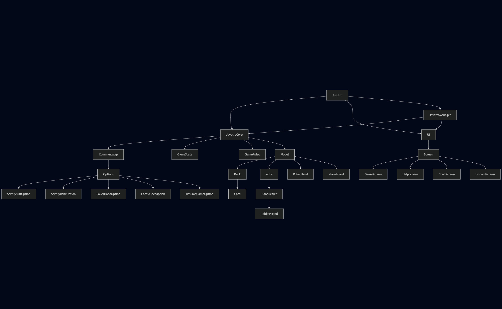


#### Application Initialization

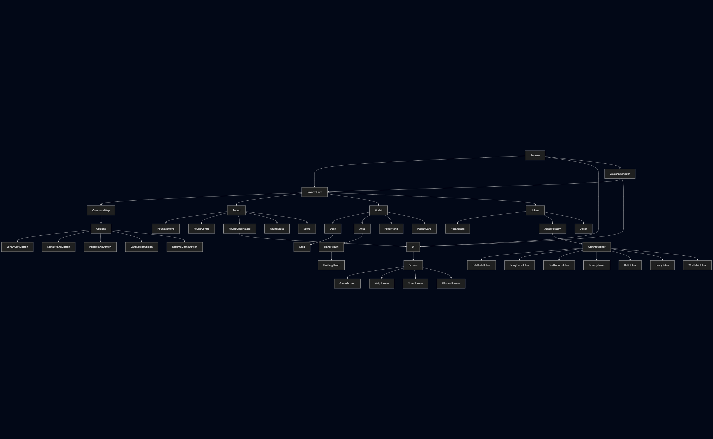

#### Gameplay Interaction

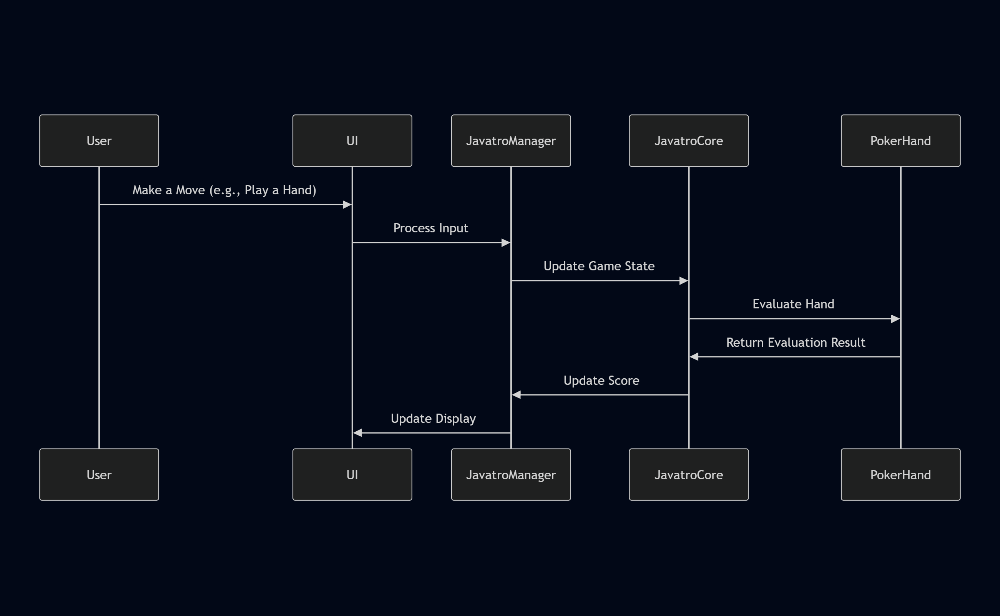

---

## UI Component

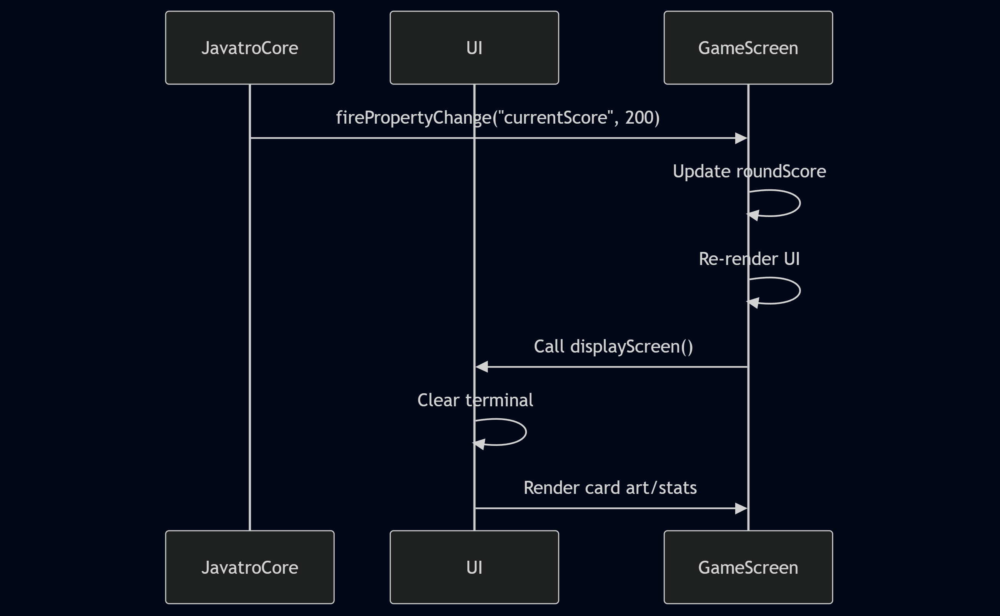

*Illustrates how `GameScreen` updates its display when the game state changes.*  

---

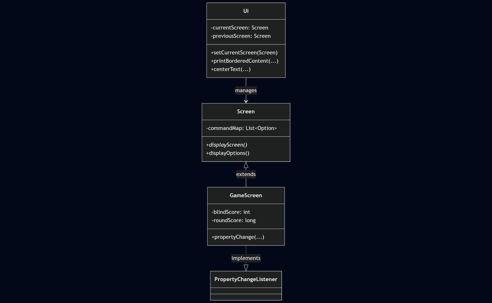
*Simplified to highlight core relationships. The `UI` manages `Screen` instances, and `GameScreen` extends `Screen` while observing game state changes.*  


### 1. Overview  
The **UI module** manages screen transitions, user input, and formatted content rendering (e.g., bordered menus, card art). Designed using the **Singleton pattern**, it ensures a single point of control for display operations. This guide details the architecture, key components, and enhancements like dynamic screen rendering and transition logic.  

---

### 2. Architectural Design  

#### 2.1. High-Level Architecture  
The UI follows a **Model-View-Controller (MVC)**-inspired design:  
- **Model**: `JavatroCore` (game state).  
- **View**: `Screen` subclasses (e.g., `GameScreen`, `StartScreen`).  
- **Controller**: `UI` class (manages transitions, input parsing).  

##### Key Design Patterns:  
1. **Singleton Pattern**: Ensures a single `UI` instance for centralized screen management.  
2. **Observer Pattern**: `GameScreen` listens to `JavatroCore` for state changes (e.g., score updates).  
3. **State Pattern**: Screens encapsulate state-specific behavior (e.g., `HelpScreen` vs. `GameScreen`).  

#### 2.2. Rationale for Key Decisions  
- **ANSI/Unicode Formatting**: Enables rich terminal UIs without external libraries.  
- **Abstract `Screen` Class**: Promotes code reuse (e.g., `displayOptions()` for command menus).  
- **Centralized `UI` Class**: Simplifies debugging and ensures consistent transitions.  

---

### 3. Component-Level Design  

#### 3.1. The `UI` Class  
**Responsibilities**:  
- **Screen Management**: Stores static references to all screens and handles transitions via `setCurrentScreen()`.  
- **Formatted Output**: Methods like `printBorderedContent()` and `centerText()` standardize layouts.  
- **Utility Functions**: `clearScreen()`, `getCardArtLines()` (renders ASCII card art).  

**Key Code Snippet**:  
```java  
public void setCurrentScreen(Screen screen) {  
    previousScreen = currentScreen;  
    currentScreen = screen;  
    currentScreen.displayScreen(); // Triggers screen-specific rendering  
    PARSER.getOptionInput(); // Handle user input  
}  
```  

#### 3.2. The `Screen` Class Hierarchy  
- **Abstract `Screen` Class**:  
  - Defines `displayScreen()` (abstract) and `displayOptions()` (common command menu).  
  - Manages `commandMap` (list of user-selectable options).  

- **Concrete Screens**:  
  - **`GameScreen`**: Displays real-time game stats, card art, and listens for state changes.  
  - **`HelpScreen`**: Shows static help content.  

**Example: `GameScreen` Property Listener**  
```java  
public void propertyChange(PropertyChangeEvent evt) {  
    switch (evt.getPropertyName()) {  
        case "currentScore":  
            roundScore = (Long) evt.getNewValue();  
            break;  
        // ... other cases  
    }  
    displayScreen(); // Re-render UI on state change  
}  
```  

---

### 5. Key Enhancements  

#### 5.1. Enhancement: Screen Transition Mechanism  

**Implementation**:  
- **Transition Messages**: ANSI-formatted logs (e.g., `Transitioning to: GameScreen`).  
- **Back Navigation**: `previousScreen` allows reverting to prior states (e.g., exiting `HelpScreen`).  

**Sequence Diagram**:  
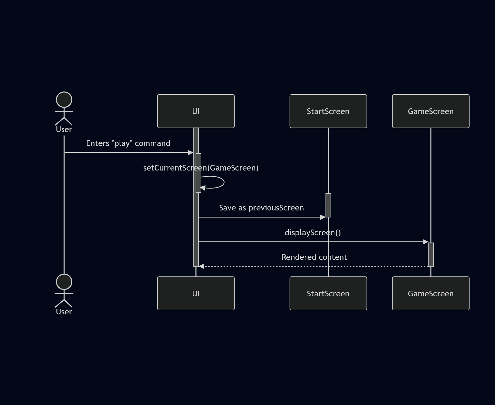

**Alternatives Considered**:  
- **Stack-Based History**: Rejected due to limited navigation depth requirements.  
- **Immediate Input Handling**: Chose deferred parsing via `Parser` to decouple input from rendering.  

#### 5.2. Enhancement: Dynamic Card Rendering  
- **Card Art Generation**: `CardRenderer` converts `Card` objects to ASCII art with ANSI colour formatting.  
- **Grid Layout**: Renders 8 cards in two rows, spaced with ANSI backgrounds.  

**Code Snippet**:  

```java  
public static List<String> getCardArtLines(List<Card> hand) {  
    List<String> lines = new ArrayList<>();  
    String[][] renderedCards = hand.stream()
            .map(CardRenderer::renderCard)
            .toArray(String[][]::new);  
    // Combine lines horizontally  
    return lines;  
}  
```

#### **5.3. Challenge: Emoji and Unicode Compatibility**  

##### **Initial Attempt**  
Emojis and Unicode symbols (e.g., 🃏, ♥️, ♥) were initially incorporated into the UI to enhance visual appeal. For example:  

```java  
// Early prototype (discarded)  
private static String getSuitSymbol(Card.Suit suit) {  
    return switch (suit) {  
        case HEARTS -> "♥️";  
        case DIAMONDS -> "♦️";  
        case CLUBS -> "♣️";  
        case SPADES -> "♠️";  
    };  
}  
```  

##### **Challenges**  
1. **Inconsistent Spacing**:  
   - Emojis/Unicode symbols vary in display width (e.g., `♥️` vs. `♠️`), causing misalignment in card art.  
   - Example: A heart symbol might be very slightly larger than a regular spacing, breaking grid layouts.  

2. **Terminal Compatibility**:  
   - Terminals like **Windows CMD / Windows Powershell** require `chcp 65001` to display Unicode, which is error-prone for users.  
   - Colored emojis are unsupported in many terminals, leading to monochrome or placeholder symbols (e.g., ` `).  

3. **ANSI Overlap**:  
   - Combining ANSI color codes with Unicode symbols introduced unpredictable formatting (e.g., background colors bleeding into adjacent text).  

##### **Final Approach**  
To ensure cross-terminal compatibility and consistent spacing, **letters** (`H`, `D`, `C`, `S`) replaced symbols:  

```java  
// Current implementation (CardRenderer.java)  
private static String getSuitSymbol(Card.Suit suit) {  
    return switch (suit) {  
        case HEARTS -> "H";  
        case DIAMONDS -> "D";  
        case CLUBS -> "C";  
        case SPADES -> "S";  
    };  
}  
```  

- **Advantages**:  
  - Fixed-width characters ensure alignment in card art.  
  - Works universally across terminals without configuration.  
  - ANSI colors apply cleanly to letters (e.g., `H` in red for hearts).  

---

#### **UML Diagrams**  

##### **CardRenderer Class Diagram**  

*The `CardRenderer` class maps suits to letters (`H`, `D`, `C`, `S`) and colors using ANSI codes.*  

##### **Card Rendering Sequence Diagram**  
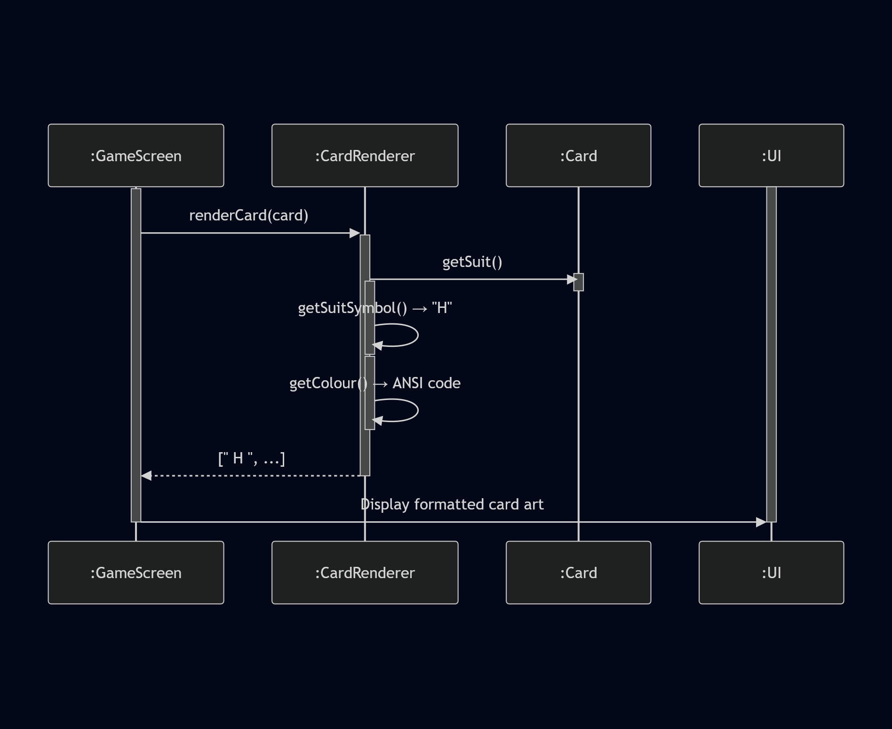


#### **Key Takeaways**  
- **Prioritize Functionality Over Aesthetics**: Letters ensured reliability, while emojis introduced terminal-specific bugs.  
- **Test Across Environments**: The decision to avoid Unicode was driven by rigorous testing in CMD, PowerShell, and Unix terminals.  
- **Code Hygiene**: Unused symbols (e.g., `♠` in `UI`) should be removed in future refactoring.  

This approach balances visual clarity with technical robustness, ensuring the UI works seamlessly for all users.

---

### 6. Future Considerations  

1. **GUI Framework Integration**: Migrate to JavaFX for animations and mouse support.  
2. **Theming System**: Allow users to customize colors via config files.  
3. **Accessibility Mode**: Add high-contrast themes and screen-reader support.  

---

### 7. Conclusion  
The UI module’s design prioritizes modularity, extensibility, and terminal compatibility. By combining design patterns like Singleton and Observer with ANSI formatting, it delivers a responsive and visually consistent experience. Future developers can extend it by adding new `Screen` subclasses or integrating modern GUI frameworks.


## Model Component

## Ante and Blind class system :

### 1. Introduction

The **Ante and Blind System** in the game determines the minimum required score to beat for each round and regulates the increasing stakes as the game progresses. The **Ante** sets a base score to beat, while the **Blind** system introduces different blind levels (SMALL, LARGE, BOSS) each with a unique multiplier score effect to ensure competitive play. This section provides an in-depth look into its implementation, design choices, and a UML sequence diagram illustrating interactions.

### 2. Implementation

#### 2.1 Class Overview

The Ante class manages the ante value and blind progression. There are a total of 8 antes where each ante consists of 3 blinds (SMALL, LARGE, BOSS). The ante class maintains the current ante level the gameplay is at , determines the betting stakes, and updates the blind stage as the game progresses. 

#### 2.2 Attributes

_int MAX_ANTE_COUNT_ = 8; – Defines the maximum ante level progression.
_int anteCount;_ – Stores the current ante level.
_Blind blind;_ – Represents the current blind stage.
_int[] anteScore;_ – An array storing predefined ante values for each level.

#### 2.3 Enum: Blind Levels

The **Blind** enum represents different blind levels, each with a unique multiplier affecting the ante base score. Additionally, the **SMALL** and **LARGE** blinds are optional, giving the players a choice to accept or reject, meanwhile the **BOSS** blind is compulsory for the players to proceed to the next round.

**Code Snippet** :

```
public enum Blind {
SMALL_BLIND(1.0, "SMALL BLIND"),
LARGE_BLIND(1.5, "LARGE BLIND"),
BOSS_BLIND(2.0, "BOSS BLIND");

private final double multiplier;
private final String name;

Blind(double multiplier, String name) {
this.multiplier = multiplier;
this.name = name;
}
public double getMultiplier() {
return multiplier;
}
public String getName() {
return name;
}
}
```

#### 2.4 Methods
**_public Ante()_:** 
Initializes ante at level 1 with Small Blind.

**public int getRoundScore()** :
Returns the ante score multiplied by the unique blind multiplier.

**_public void setAnteCount(int anteCount)_:**
Updates the ante count within valid bounds.

**_public void resetAnte()_:**
Resets ante to level 1 and Small Blind.

**_public void nextRound()_:**
Progresses to the next blind level or increases ante level when Boss Blind is reached.

### 3. Design Considerations

## 3.1 Alternatives Considered

**1. Fixed Ante and Blind System**:
   Pros: Simple to implement and requires minimal logic.
   Cons: Lacks adaptability, making the game less engaging over time.

**2. Dynamic Blind Adjustment**:
   Pros: Adjusts difficulty dynamically, providing a more balanced progression.
   Cons: Requires additional tracking and logic to manage changes effectively.

## 3.2 Chosen Approach
   To balance simplicity and dynamic progression, the enum-based structured Blind System. It cycles through Small Blind → Large Blind → Boss Blind, ensuring controlled progression while increasing the ante at the end of each cycle. This approach keeps gameplay engaging without overcomplicating the logic. Moreover the array-based ante progression simplifies lookup and ensures consistent bet increases. This structure prevents unfair jumps in bet sizes, ensuring a fairer experience for the players.

## Class Diagram:


The Ante class manages the ante count, blind levels, and scores in the game, utilizing the Blind enumeration for different blind levels.


The Option interface is implemented by AcceptBlindOption and RejectBlindOption, which interact with JavatroCore, JavatroManager, and UI to manage blind options in the game.

## Sequence Diagram:

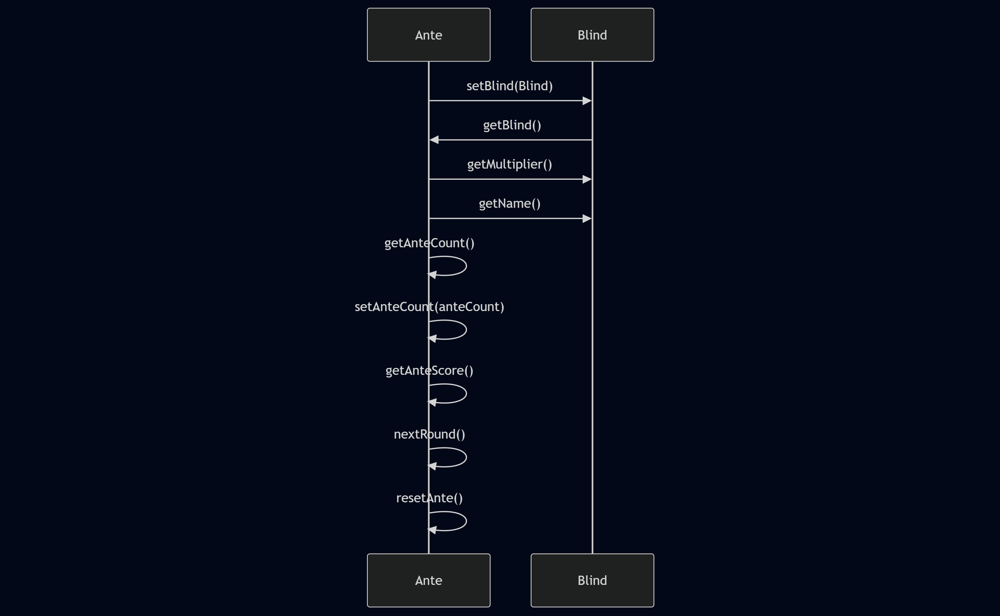

This sequence diagram illustrates the interactions between the Ante and Blind classes, where Ante sets and retrieves blind information, as well as manages ante-related operations such as updating scores and counts.

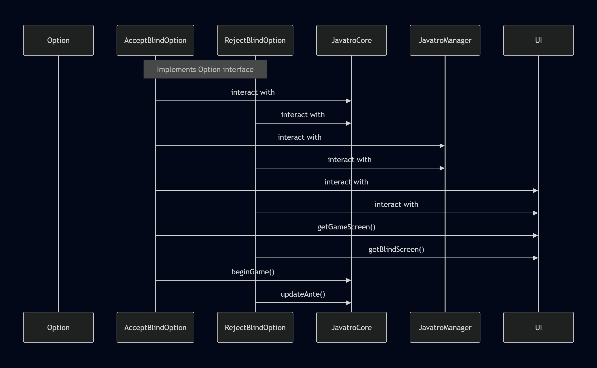

This sequence diagram shows the interactions between the Option implementations (AcceptBlindOption and RejectBlindOption), and their interactions with JavatroCore, JavatroManager, and UI, including actions such as beginning the game, updating ante, and retrieving screens.

---

### Logic Component

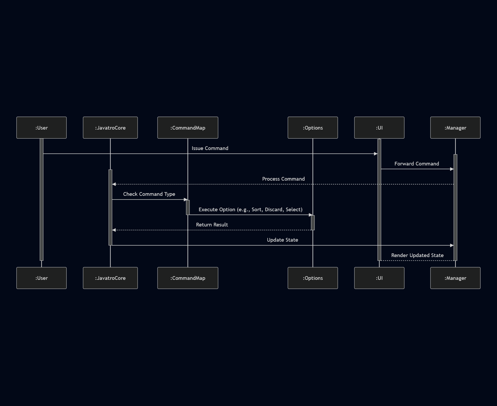


The Logic Component serves as the Controller in the Model-View-Controller (MVC) architecture. It is responsible for managing the application's core logic, processing user commands, and interacting with the Model (e.g., Deck, Ante, PokerHand) through well-defined interfaces. It updates the View through the manager classes.

All classes within the core package make up the Logic Component. This does not include the Deck, Ante, and PokerHand classes, as these are part of the Model. Instead, the Logic Component uses these classes to perform operations and process commands.

- `JavatroCore`: The central controller managing the game flow, initializing components, and processing game state updates.

This component interacts with the UI and Manager components to process user inputs and update the view accordingly.

---

### Round Component

The **Round Component** is responsible for managing the state and flow of a single round in the game. It encapsulates the logic for handling round-specific actions, configurations, and any special effects.

#### Responsibilities
- Manage the state of the current round, including the cards dealt, scores, and player actions.
- Handle round-specific configurations and validation.
- Notify other components (e.g., UI, Logic) of state changes during the round.

#### Key Classes
- **Round**: The main class that orchestrates the round's lifecycle.
- **RoundState**: Tracks the current state of the round (e.g., active, completed).
- **RoundActions**: Encapsulates actions that can be performed during the round (e.g., draw, discard).
- **RoundConfig**: Stores configuration settings for the round (e.g., max cards, scoring rules).
- **RoundObservable**: Implements the observer pattern to notify listeners (e.g., UI) of state changes.


#### Round Sequence Diagram: Round Initialization

The following sequence diagram illustrates the initialization process of a round, including configuration setup and state management.

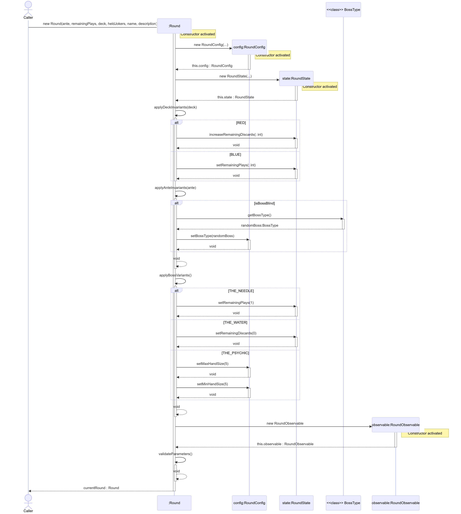

#### Round Sequence Diagram: playCards method

The following sequence diagram illustrates the process of playing cards during a round.


#### Round Sequence Diagram: discardCards method
The following sequence diagram illustrates the process of discarding cards during a round.


#### Round Sequence Diagram: isWon method
The following sequence diagram illustrates the process of checking if a round is won.


#### Round Sequence Diagram: isRoundOver method
The following sequence diagram illustrates the process of checking if a round is over.


#### RoundActions Sequence Diagram: playCards method
The following sequence diagram illustrates the process of playing cards during a round.

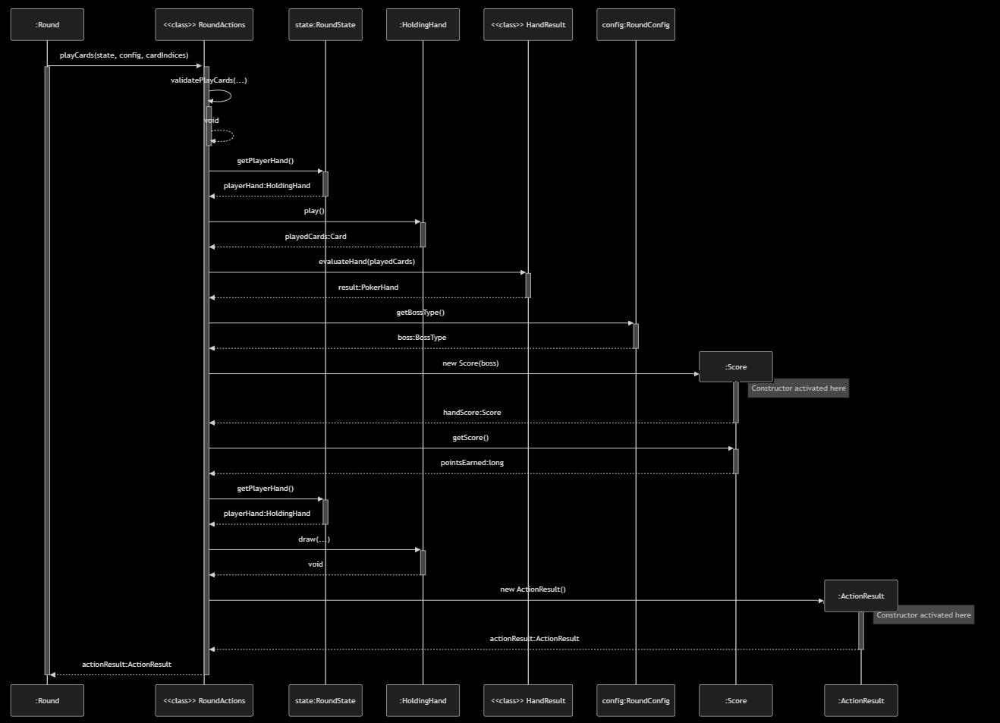

#### RoundActions Sequence Diagram: discardCards method
The following sequence diagram illustrates the process of discarding cards during a round.

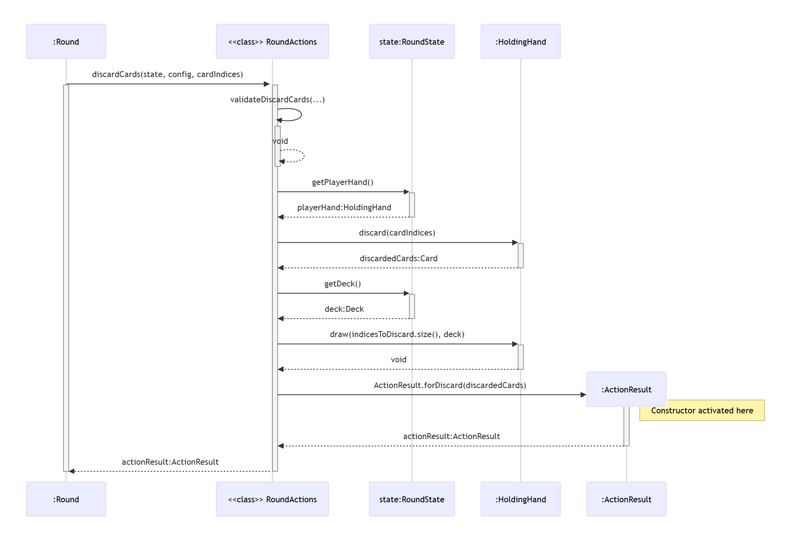


### Score Component
The **Score Component** is part of Javatro's scoring system, responsible for calculating the final score based on the played hand, cards, and active jokers. It encapsulates the logic for handling score calculations.


#### Responsibilities
- Handle calculation of scoring played hands, factoring in round-specific configurations and validation.

#### Class Diagram: Score and involved classes
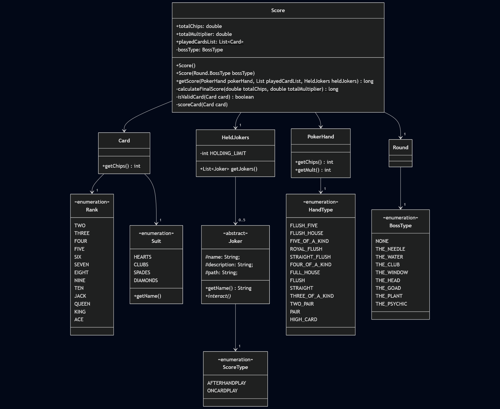

#### Score Calculation Overview
Below is how the Score Class returns the calculated score:

1. `Round` initializes `Score`, and `Score` invokes the `getChips()` method from `PokerHand`.

2. With each `Card` passed from `Score`, `Score` checks whether the card played satisfies BossType conditions, 
and applies effects if the condition is satisfied. Else, the `Card` is scored, and each `Joker` in `heldJokers` is checked if the `Card` can interact with the `Joker`
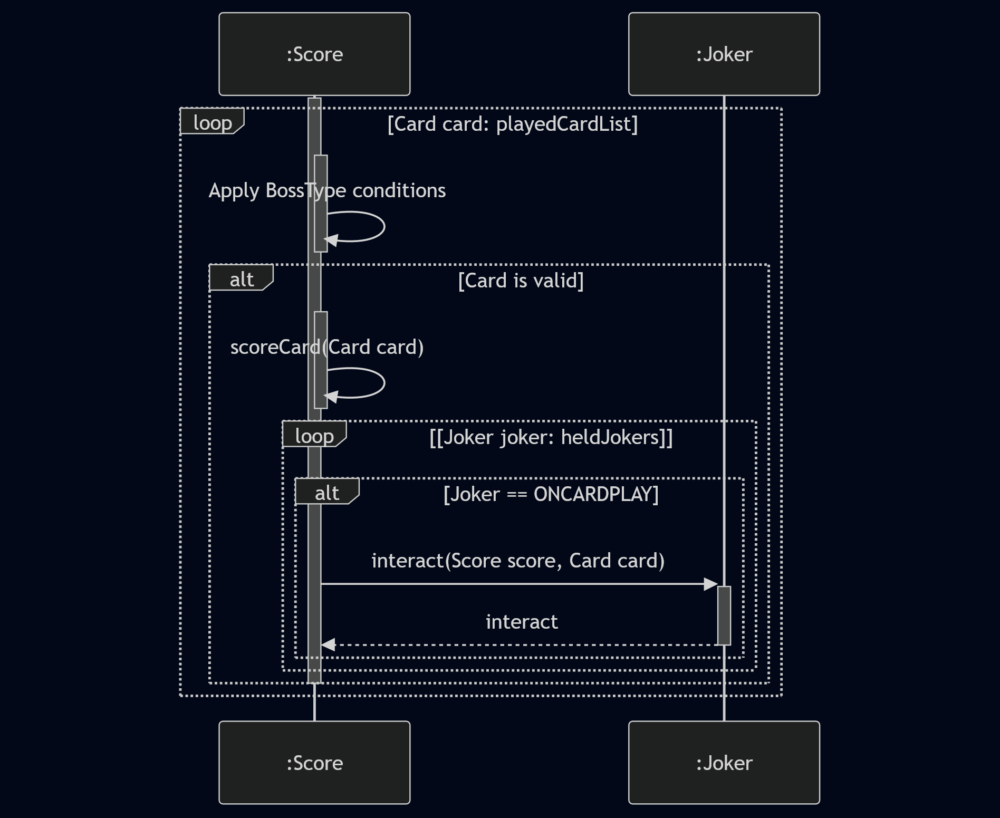
3. After each `Card` is scored, any `Joker` with the `AFTERHANDPLAY` enum is interacted with.
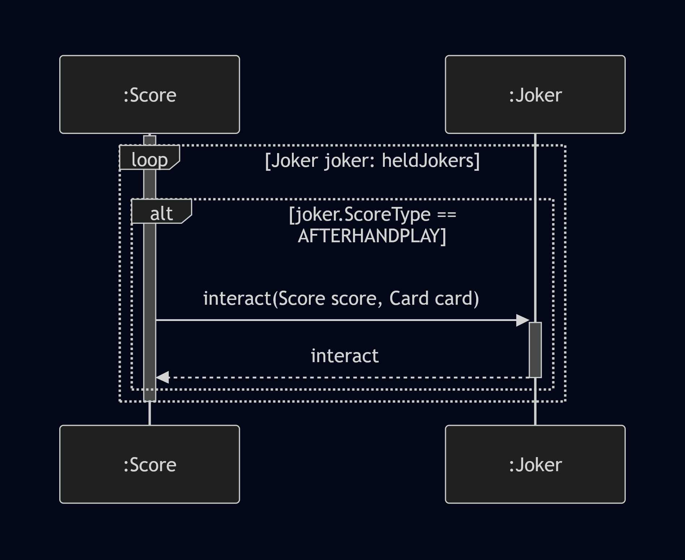
4. `Score` rounds the final score using `calculateFinalScore()` and returns the final `long` value to `Round`.
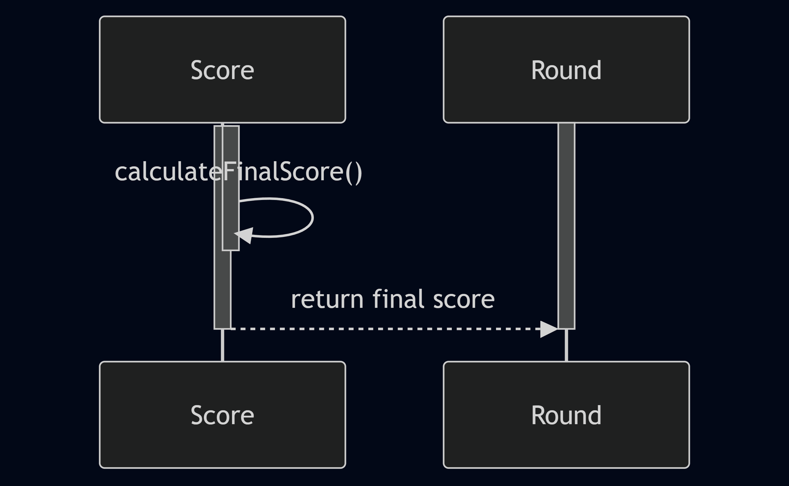

#### Overall Sequence Diagram for Score Calculation


## Implementation

### Logic Flow

The application's logic flow is divided into several parts:

1. **Initialization**: The application initializes core components and prepares the user interface.
2. **Gameplay**: Users interact with the UI to perform actions, triggering methods in the core logic.
3. **Round Progression**: Ante handling and deck operations are updated between rounds.
4. **Evaluation**: Poker hands are evaluated using the `PokerHand` class.

### Overview

The Javatro application consists of several packages:

- `javatro`: The main entry point and application setup.
- `core`: Core logic, including card handling, ante management, and game rules.
- `display`: User interface handling, including screens and rendering.
- `manager`: Management of different game states and transitions.

### Key Components

- `Javatro`: Initializes and starts the application.
- `JavatroCore`: Handles core game logic such as dealing cards, evaluating hands, and managing ante.
- `Deck`: Manages the deck of cards, shuffling, drawing, etc.
- `Ante`: Handles the ante mechanism, score calculation, and progression through rounds.
- `PokerHand`: Handles poker-specific card evaluation.

### Important Methods

- `main()`: Initializes the application.
- `initialize()`: Sets up core components.
- `playRound()`: Manages the game round progression.
- `draw()`: Draws a card from the deck.
- `shuffle()`: Shuffles the deck.
- `getRoundScore()`: Retrieves the score for the current round.
- `nextRound()`: Progresses to the next round.
- `evaluateHand()`: Evaluates a set of cards according to poker rules.

---

## Documentation, logging, testing, configuration, dev-ops

### Documentation

The documentation is structured as follows:

- **User Guide**: Located at `docs/UserGuide.md`. Describes how to set up and use the application.
- **Developer Guide**: Located at `docs/DeveloperGuide.md`. Contains design explanations, architecture, and implementation details.
- **API Documentation**: Generated using Javadoc. To generate, run:

```
./gradlew javadoc
```

Output will be available under `build/docs/javadoc/`.

### Testing

The testing follows the main Javatro package structure, as shown below:
- `core`: Tests written for core logic, including card handling, ante management, and game rules.
- `round`: Tests written for round logic, including round sanity checks.
- `display`: Tests written for checking screens rendering correctly and in the right sequence.
- `manager`: Tests written for monitoring game states after each action is played.

---

## Appendix: Requirements

## Product Scope

### Target user profile:
- Card game enthusiasts and roguelike fans who enjoy strategic deck-building experiences and prefer playing games in a command-line interface (CLI) environment.
- Tech-savvy individuals who are comfortable with command-line interfaces and prefer typing commands over using graphical user interfaces.
- Roguelike and card game enthusiasts who enjoy strategic, turn-based gameplay and have an interest in card games, particularly those with roguelike elements.
- Minimalist gamers who appreciate minimalist design and are drawn to text-based gaming experiences that focus on gameplay depth rather than visual aesthetics.
- Cross-platform users who use various operating systems and seek a consistent gaming experience across platforms, which a CLI application can provide.

### Value proposition: 
Javatro provides a streamlined, text-based roguelike deck-building experience inspired by Balatro. It offers a strategic and replayable poker-based gameplay loop in a lightweight, no-graphics format, making it accessible for users who enjoy card games without requiring a graphical interface.

## User Stories

**Priorities:** High (must have) - `* * *`, Medium (nice to have) - `* *`, Low (unlikely to have) - `*`

| Priority | User Role       | User Story                                                                                        |
|----------|-----------------|---------------------------------------------------------------------------------------------------|
| * * *    | New Player      | I want to start a new game so that I can begin a new deck-building run.                           |
| * * *    | Active Player   | I want to play a hand of poker using my cards so that I can progress in the game.                 |
| * * *    | Active Player   | I want to discard and redraw a limited number of cards so that I can improve my current hand.     |
| * * *    | Active Player   | I want to see my score and chips after playing a hand so that I can keep track of my progress.    |
| * * *    | Active Player   | I want to earn multipliers based on the poker hand I complete so that I can maximize my score.    |
| * * *    | New Player      | I want to view instructions so that I can understand how to play the game.                        |
| * * *    | Active Player   | I want to save my progress so that I can resume the game later.                                   |
| * * *    | Active Player   | I want to load a saved game so that I can continue my progress.                                   |
| * *      | Active Player   | I want to sort my cards by rank or suit so that I can better organize my hand.                    |
| * *      | Active Player   | I want to view game statistics so that I can track my performance over multiple runs.             |
| * *      | Advanced Player | I want to enable advanced features so that I can enjoy a more complex gameplay experience.        |
| * *      | Player          | I want to view a help menu so that I can learn more about the available commands.                 |
| *        | Active Player   | I want to customize gameplay settings so that I can tailor the game experience to my preferences. |
| *        | Advanced Player | I want to use additional deck types so that I can have a varied experience.                       |
| *        | Advanced Player | I want to enable hard mode so that I can increase the difficulty of the game.                     |
| *        | Active Player   | I want to view my progress summary after each run so that I can evaluate my performance.          |
| *        | Active Player   | I want to undo my last move so that I can correct mistakes.                                       |
| *        | Active Player   | I want to replay previous rounds so that I can refine my strategies.                              |
| *        | Active Player   | I want to set a high score target so that I can challenge myself.                                 |
| *        | Active Player   | I want to compare my score with other players so that I can see where I stand.                    |
| *        | Active Player   | I want to pause the game so that I can take breaks when necessary.                                |
| *        | Active Player   | I want to change controls so that I can personalize the game experience.                          |
| *        | Active Player   | I want to view a log of previous moves so that I can analyze my strategies.                       |
| *        | Active Player   | I want to restart the game so that I can try different strategies.                                |
| *        | Active Player   | I want to adjust volume settings so that I can control the audio experience.                      |
| *        | Advanced Player | I want to customize card designs so that I can enhance my visual experience.                      |
| *        | Advanced Player | I want to view daily challenges so that I can have new objectives to pursue.                      |
| *        | Advanced Player | I want to participate in weekly events so that I can earn special rewards.                        |
| *        | Advanced Player | I want to access leaderboards so that I can compare my performance globally.                      |
| *        | Advanced Player | I want to unlock achievements so that I can track my milestones.                                  |
| *        | Advanced Player | I want to review past games so that I can learn from my mistakes.                                 |
| *        | Advanced Player | I want to export my progress so that I can preserve my achievements.                              |

## Use Cases

(For all use cases below, the **System** is the `Javatro` and the **Actor** is the `User`, unless specified otherwise)

---

### Use case: Discard and Draw Cards

**MSS (Main Success Scenario)**

1. User requests to view their current hand.
2. System displays the current hand of cards.
   1. Use case ends.
3. User selects cards to discard.
   1. The user selects invalid cards for discarding.
      1. System shows an error message.
      2. Use case resumes at step 2.
4. System removes the selected cards and draws new cards to replace them.
5. System displays the updated hand.

Use case ends.

---

### Use case: Save Game Progress

**MSS (Main Success Scenario)**

1. User requests to save the game.
2. System serializes the current game state.
3. System saves the serialized data to a file.
   1. The file cannot be created or written.
      1. System shows an error message indicating failure to save.
      2. Use case ends.
4. System confirms that the game has been successfully saved.

Use case ends.

---

### Use case: Load Saved Game

**MSS (Main Success Scenario)**

1. User requests to load a previously saved game.
2. System presents a list of available saved game files.
   1. No saved game files are found.
      1. Use case ends.
3. User selects a saved game file to load.
4. System reads the file and deserializes the game state.
   1. The selected file is corrupted or incompatible.
      1. System shows an error message.
      2. Use case ends.
5. System initializes the game to the loaded state.

---

## Non-Functional Requirements

### Performance Requirements
- The system should be able to process user commands and update the game state within **0.5 seconds** of user input.
- The system should support a **minimum of 1000 hands played** without noticeable performance degradation.

### Reliability Requirements
- The game should **not crash or produce errors** during normal gameplay for at least **20 hours of continuous use**.
- Saved game data must be **correctly serialized and deserialized** to ensure that saved progress is accurately restored.

### Availability Requirements
- The application should be available **99.9% of the time** when executed on a compatible platform.
- Saved games should remain accessible even after **abrupt termination of the application**.

### Usability Requirements
- The system should provide **clear and concise error messages** when invalid commands are entered.
- The CLI interface should support **standard text-based commands** and provide detailed help instructions.

### Security Requirements
- Saved game files should be protected from **unauthorized modification** by ensuring **read-only access** unless within the game environment.
- The system should prevent **malformed input** from causing crashes or corrupting game data.

### Portability Requirements
- The game should be compatible with **Windows, Linux, and MacOS**.
- The system should work on **both 32-bit and 64-bit architectures**.

### Maintainability Requirements
- The codebase should maintain a **test coverage of at least 90%** to ensure robustness against changes.
- The architecture should allow for **adding new game rules and features with minimal modification to existing code**.

### Scalability Requirements
- The game should support **future expansion** to include additional game modes or card types without requiring a complete rewrite of the core system.
- The system should handle **at least 10 concurrent games** if implemented in a multiplayer environment.

### Documentation Requirements
- Comprehensive documentation should be available for:
  - **Installation and setup**
  - **Gameplay instructions**
  - **Developer guides** with architecture diagrams and explanations.

### Glossary

**Ante**  
A stage of a run. Each run is divided into multiple antes (usually eight),
with each ante consisting of several rounds ( 3 blinds per ante) that you must clear to progress. As the
antes increase, the score to beat also progressively increases.

**Blind**  
A round within an ante where you must score enough points (chips) to beat the challenge. There are three types:
- **Small Blind**: The first round; you can skip or play it.
- **Big Blind**: The second round; you can skip or play it.
- **Boss Blind**: The final round of an ante with a unique, often restrictive challenge. This round cannot be skipped.

**Chips**  
Points earned from playing a hand.
Each hand’s chip value is calculated from the cards played and later multiplied by a multiplier.

**Multiplier**  
A factor that increases your hand’s chip score.
Multipliers can be raised through various effects, most notably by equipping Joker cards and obtaining Planet Cards.

**Joker**  
Special cards that reside in your “Joker slots” (up to five by default) and grant passive effects.
These effects may add chips, boost multipliers, or modify how hands are scored.

**Playing Cards**  
The standard cards (initially a 52-card deck) that form the basis of every hand.

**Planet Cards**  
Upgrades specific poker hand types by increasing their base chip value and multiplier.

**Discard**  
A limited resource per round that lets you exchange unwanted cards from your hand.
Managing discards is crucial for optimizing your hand.

**Hand Size**  
The number of cards drawn at the start of each round. It determines your options for forming poker hands.

**Hands**  
The number of times you can play cards during a round (similar to “lives”).
If you run out of hands before meeting the blind’s score, the run ends.

**Run**  
A complete play session. A run ends when you fail an ante or successfully clear the final Boss Blind.

---
