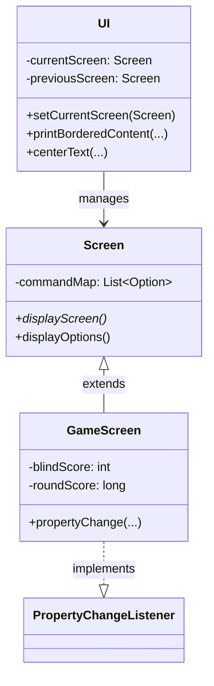
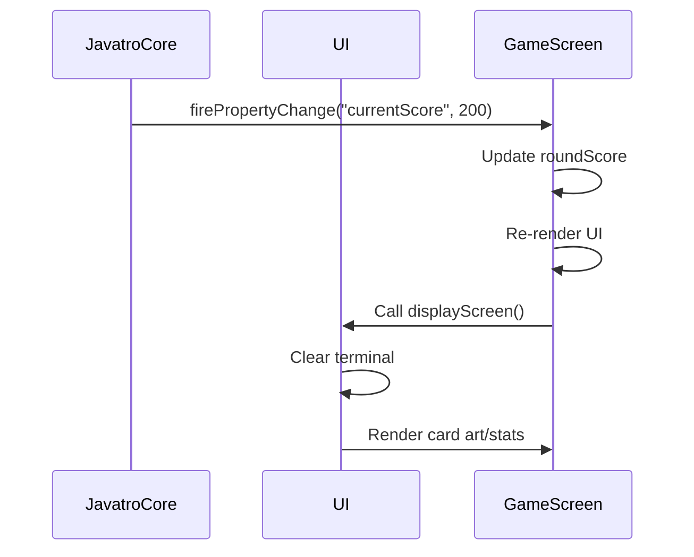
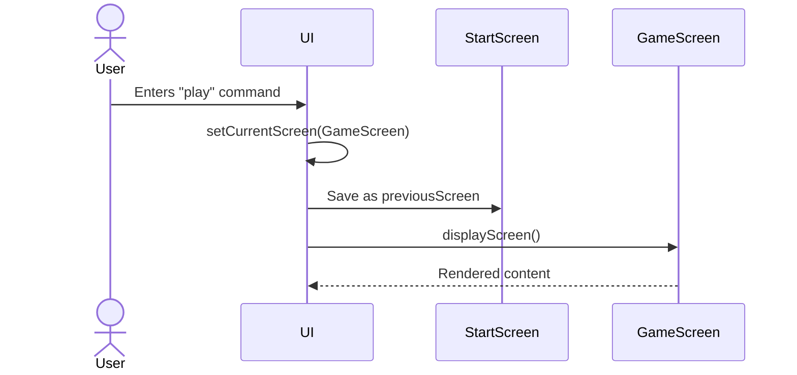
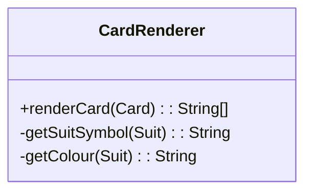
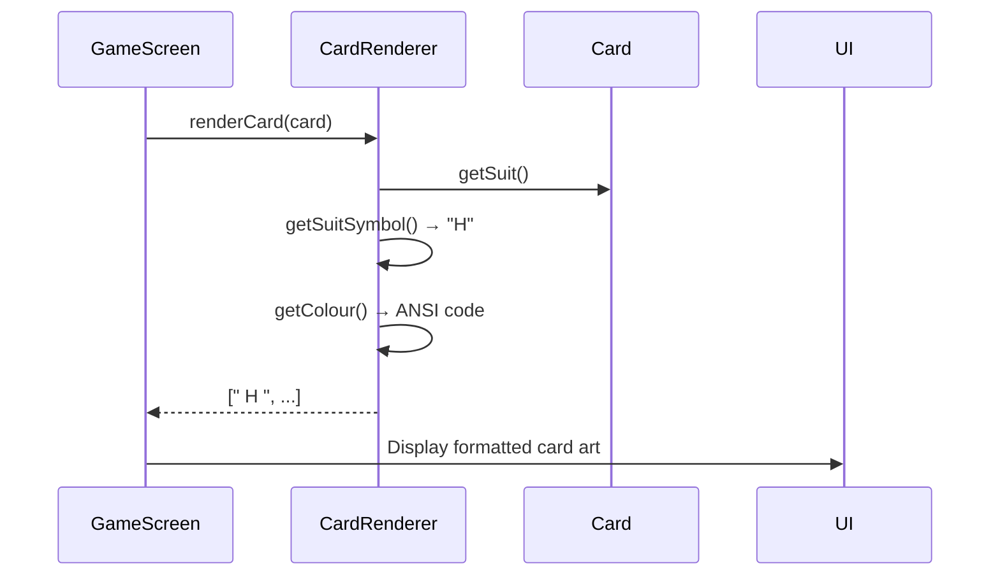

# Developer Guide – UI Implementation  

## 1. Overview  
The **UI module** manages screen transitions, user input, and formatted content rendering (e.g., bordered menus, card art). Designed using the **Singleton pattern**, it ensures a single point of control for display operations. This guide details the architecture, key components, and enhancements like dynamic screen rendering and transition logic.  

---

## 2. Architectural Design  

### 2.1. High-Level Architecture  
The UI follows a **Model-View-Controller (MVC)**-inspired design:  
- **Model**: `JavatroCore` (game state).  
- **View**: `Screen` subclasses (e.g., `GameScreen`, `StartScreen`).  
- **Controller**: `UI` class (manages transitions, input parsing).  

#### Key Design Patterns:  
1. **Singleton Pattern**: Ensures a single `UI` instance for centralized screen management.  
2. **Observer Pattern**: `GameScreen` listens to `JavatroCore` for state changes (e.g., score updates).  
3. **State Pattern**: Screens encapsulate state-specific behavior (e.g., `HelpScreen` vs. `GameScreen`).  

### 2.2. Rationale for Key Decisions  
- **ANSI/Unicode Formatting**: Enables rich terminal UIs without external libraries.  
- **Abstract `Screen` Class**: Promotes code reuse (e.g., `displayOptions()` for command menus).  
- **Centralized `UI` Class**: Simplifies debugging and ensures consistent transitions.  

---

## 3. Component-Level Design  

### 3.1. The `UI` Class  
**Responsibilities**:  
- **Screen Management**: Stores static references to all screens and handles transitions via `setCurrentScreen()`.  
- **Formatted Output**: Methods like `printBorderedContent()` and `centerText()` standardize layouts.  
- **Utility Functions**: `clearScreen()`, `getCardArtLines()` (renders ASCII card art).  

**Key Code Snippet**:  
```java  
public void setCurrentScreen(Screen screen) {  
    previousScreen = currentScreen;  
    currentScreen = screen;  
    currentScreen.displayScreen(); // Triggers screen-specific rendering  
    PARSER.getOptionInput(); // Handle user input  
}  
```  

### 3.2. The `Screen` Class Hierarchy  
- **Abstract `Screen` Class**:  
  - Defines `displayScreen()` (abstract) and `displayOptions()` (common command menu).  
  - Manages `commandMap` (list of user-selectable options).  

- **Concrete Screens**:  
  - **`GameScreen`**: Displays real-time game stats, card art, and listens for state changes.  
  - **`HelpScreen`**: Shows static help content.  

**Example: `GameScreen` Property Listener**  
```java  
public void propertyChange(PropertyChangeEvent evt) {  
    switch (evt.getPropertyName()) {  
        case "currentScore":  
            roundScore = (Long) evt.getNewValue();  
            break;  
        // ... other cases  
    }  
    displayScreen(); // Re-render UI on state change  
}  
```  

---

## 4. UML Diagrams  

### 4.1. Class Diagram  

*Simplified to highlight core relationships. The `UI` manages `Screen` instances, and `GameScreen` extends `Screen` while observing game state changes.*  

### 4.2. Sequence Diagram – Dynamic GameScreen Rendering  

*Illustrates how `GameScreen` updates its display when the game state changes.*  

---

## 5. Key Enhancements  

### 5.1. Enhancement: Screen Transition Mechanism  
**Implementation**:  
- **Transition Messages**: ANSI-formatted logs (e.g., `Transitioning to: GameScreen`).  
- **Back Navigation**: `previousScreen` allows reverting to prior states (e.g., exiting `HelpScreen`).  

**Sequence Diagram**:  


**Alternatives Considered**:  
- **Stack-Based History**: Rejected due to limited navigation depth requirements.  
- **Immediate Input Handling**: Chose deferred parsing via `Parser` to decouple input from rendering.  

### 5.2. Enhancement: Dynamic Card Rendering  
- **Card Art Generation**: `CardRenderer` converts `Card` objects to ASCII art with ANSI colour formatting.  
- **Grid Layout**: Renders 8 cards in two rows, spaced with ANSI backgrounds.  

**Code Snippet**:  
```java  
public static List<String> getCardArtLines(List<Card> hand) {  
    List<String> lines = new ArrayList<>();  
    String[][] renderedCards = hand.stream().map(CardRenderer::renderCard).toArray(String[][]::new);  
    // Combine lines horizontally  
    return lines;  
}  
```

### **5.3. Challenge: Emoji and Unicode Compatibility**  

#### **Initial Attempt**  
Emojis and Unicode symbols (e.g., 🃏, ♥️, ♥) were initially incorporated into the UI to enhance visual appeal. For example:  
```java  
// Early prototype (discarded)  
private static String getSuitSymbol(Card.Suit suit) {  
    return switch (suit) {  
        case HEARTS -> "♥️";  
        case DIAMONDS -> "♦️";  
        case CLUBS -> "♣️";  
        case SPADES -> "♠️";  
    };  
}  
```  

#### **Challenges**  
1. **Inconsistent Spacing**:  
   - Emojis/Unicode symbols vary in display width (e.g., `♥️` vs. `♠️`), causing misalignment in card art.  
   - Example: A heart symbol might be very slightly larger than a regular spacing, breaking grid layouts.  

2. **Terminal Compatibility**:  
   - Terminals like **Windows CMD / Windows Powershell** require `chcp 65001` to display Unicode, which is error-prone for users.  
   - Colored emojis are unsupported in many terminals, leading to monochrome or placeholder symbols (e.g., `�`).  

3. **ANSI Overlap**:  
   - Combining ANSI color codes with Unicode symbols introduced unpredictable formatting (e.g., background colors bleeding into adjacent text).  

#### **Final Approach**  
To ensure cross-terminal compatibility and consistent spacing, **letters** (`H`, `D`, `C`, `S`) replaced symbols:  
```java  
// Current implementation (CardRenderer.java)  
private static String getSuitSymbol(Card.Suit suit) {  
    return switch (suit) {  
        case HEARTS -> "H";  
        case DIAMONDS -> "D";  
        case CLUBS -> "C";  
        case SPADES -> "S";  
    };  
}  
```  
- **Advantages**:  
  - Fixed-width characters ensure alignment in card art.  
  - Works universally across terminals without configuration.  
  - ANSI colors apply cleanly to letters (e.g., `H` in red for hearts).  

---

### **UML Diagrams**  

#### **CardRenderer Class Diagram**  

*The `CardRenderer` class maps suits to letters (`H`, `D`, `C`, `S`) and colors using ANSI codes.*  

#### **Card Rendering Sequence Diagram**  


### **Key Takeaways**  
- **Prioritize Functionality Over Aesthetics**: Letters ensured reliability, while emojis introduced terminal-specific bugs.  
- **Test Across Environments**: The decision to avoid Unicode was driven by rigorous testing in CMD, PowerShell, and Unix terminals.  
- **Code Hygiene**: Unused symbols (e.g., `♠` in `UI`) should be removed in future refactoring.  

This approach balances visual clarity with technical robustness, ensuring the UI works seamlessly for all users.

---

## 6. Future Considerations  

1. **GUI Framework Integration**: Migrate to JavaFX for animations and mouse support.  
2. **Theming System**: Allow users to customize colors via config files.  
3. **Accessibility Mode**: Add high-contrast themes and screen-reader support.  

---

## 7. Conclusion  
The UI module’s design prioritizes modularity, extensibility, and terminal compatibility. By combining design patterns like Singleton and Observer with ANSI formatting, it delivers a responsive and visually consistent experience. Future developers can extend it by adding new `Screen` subclasses or integrating modern GUI frameworks.
