# Developer Guide

## Acknowledgements

{list here sources of all reused/adapted ideas, code, documentation, and third-party libraries -- include links to the original source as well}

## Design

### Architecture

#### Score
The `Score` component is part of Javatro's scoring system, responsible for calculating the final score based on the played hand, cards, and active jokers. It interacts with several components:

- `PokerHand`: Represents the type of hand played (e.g., pair, flush).

- `Card`: Represents individual cards in the game.

- `HeldJokers`: Represents the Jokers held, which have special modifiers that can affect the score.

- `Round.BossType`: Represents special game conditions that may restrict scoring.

``` mermaid
classDiagram
    class Score {
        +double totalChips
        +double totalMultiplier
        +static List<Card> playedCardsList
        +ArrayList<Joker> jokerList
        -Round.BossType bossType
        +Score()
        +Score(Round.BossType bossType)
        +long getScore(PokerHand pokerHand, List<Card> playedCardList, HeldJokers heldJokers)
        -static long calculateFinalScore(double totalChips, double totalMultiplier)
        -boolean isValidCard(Card card)
        -void scoreCard(Card card)
    }
    
    class PokerHand {
        +int getChips()
        +int getMult()
    }
    
    class Card {
        +getChips()
    }
    
    class Rank {
    <<enumeration>>
        TWO
        THREE
        FOUR
        FIVE
        SIX
        SEVEN
        EIGHT
        NINE
        TEN
        JACK
        QUEEN
        KING
        ACE
    }

    class Suit {
    <<enumeration>>
        HEARTS
        CLUBS
        SPADES
        DIAMONDS
        +getName()
    }

    class HeldJokers {
        -int HOLDING_LIMIT
        +List~Joker~ getJokers()
    }
    
    class Joker {
        <<abstract>>
        #String name;
        #String description;
        #String path;
        +String getName()
        +interact()*
    }

    class ScoreType {
        <<enumeration>>
        AFTERHANDPLAY
        ONCARDPLAY
    }
    
    class HandType {
        <<enumeration>>
        FLUSH_FIVE
        FLUSH_HOUSE
        FIVE_OF_A_KIND
        ROYAL_FLUSH
        STRAIGHT_FLUSH
        FOUR_OF_A_KIND
        FULL_HOUSE
        FLUSH
        STRAIGHT
        THREE_OF_A_KIND
        TWO_PAIR
        PAIR
        HIGH_CARD
    }
    
    class BossType {
        <<enumeration>>
        NONE
        THE_NEEDLE
        THE_WATER
        THE_CLUB
        THE_WINDOW
        THE_HEAD
        THE_GOAD
        THE_PLANT
        THE_PSYCHIC
    }

    Score --> PokerHand
    Score --> Card
    Score -->"1" HeldJokers
    Score -->"1" Round
    Round -->"1" BossType
    PokerHand -->"1" HandType
    Card -->"1" Rank
    Card -->"1" Suit
    HeldJokers -->"0..5" Joker
    Joker -->"1" ScoreType
```

## Implementation

### Scoring System
#### Score Calculation Overview
The Score class calculates the final score by:

1. Applying base values from the PokerHand.
2. Adding contributions from valid cards.
3. Applying effects from active jokers.
4. Rounding the final score.

{Describe the design and implementation of the product. Use UML diagrams and short code snippets where applicable.}

## Product scope
### Target user profile

{Describe the target user profile}

### Value proposition

{Describe the value proposition: what problem does it solve?}

## User Stories

|Version| As a ... | I want to ... | So that I can ...|
|--------|----------|---------------|------------------|
|v1.0|new user|see usage instructions|refer to them when I forget how to use the application|
|v2.0|user|find a to-do item by name|locate a to-do without having to go through the entire list|

## Non-Functional Requirements

{Give non-functional requirements}

## Glossary

* *glossary item* - Definition

## Instructions for manual testing

{Give instructions on how to do a manual product testing e.g., how to load sample data to be used for testing}
