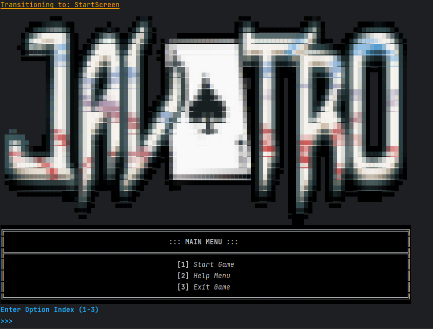
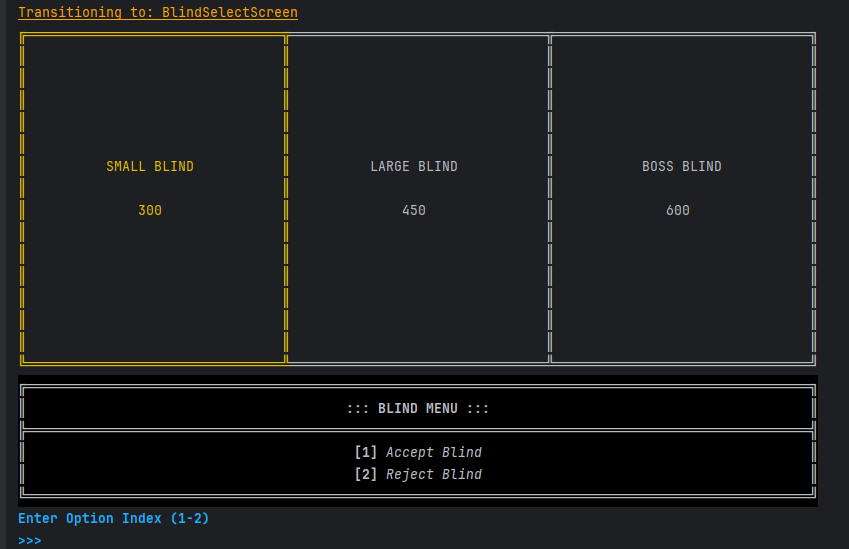
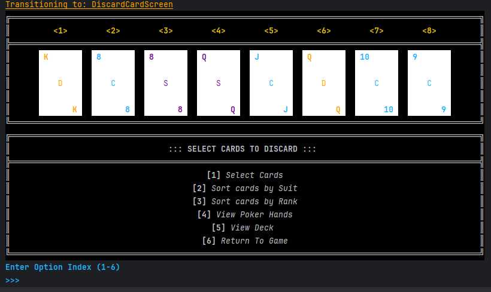
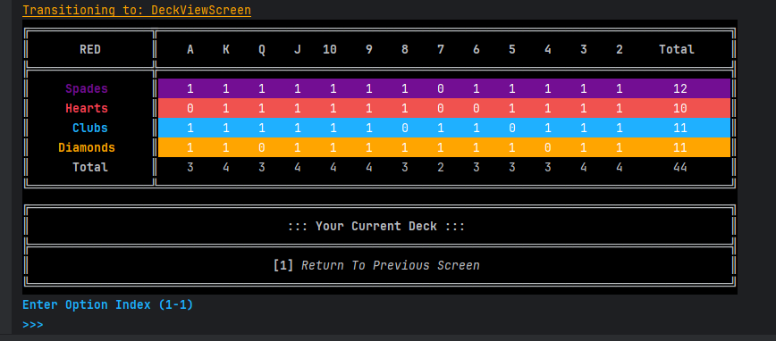
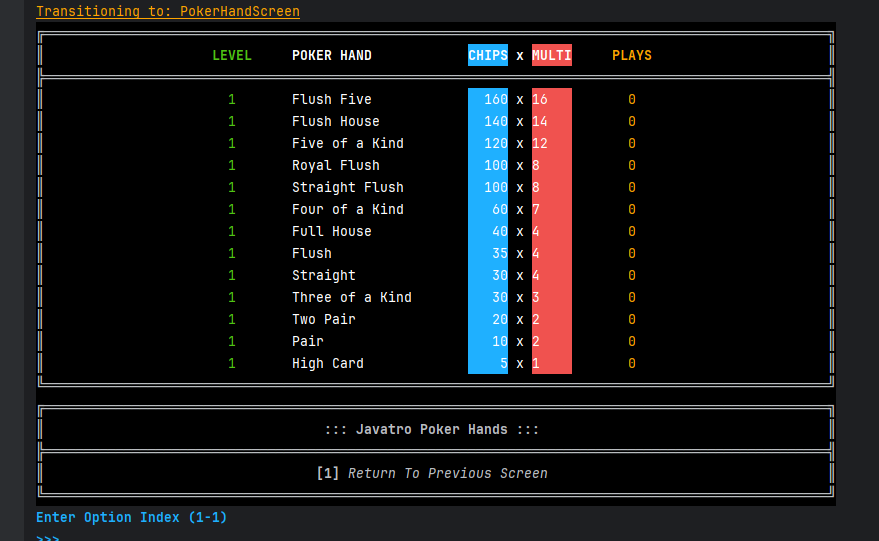
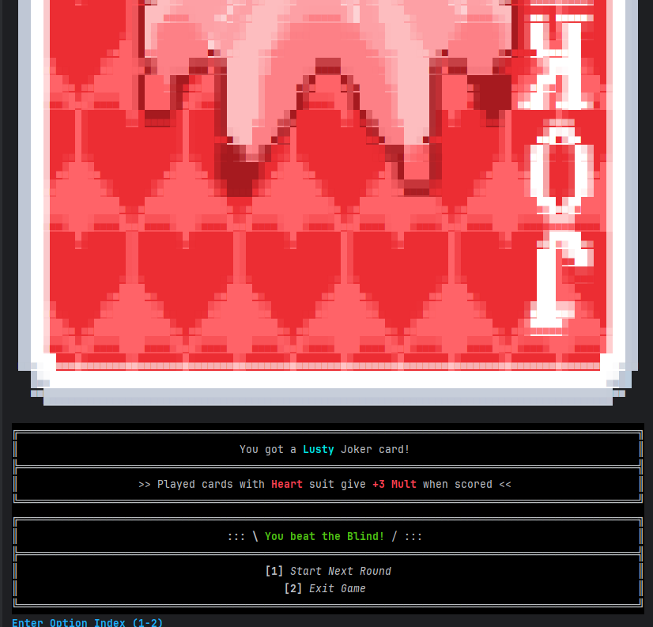

# Javatro User Guide

**Javatro** is a command line card game based on **Balatro**, designed to be played via a Command Line Interface (CLI). It offers various deck options, scoring mechanisms, and strategic gameplay. This guide will walk you through the features, usage, and functionalities of the application.

- [What is Javatro?](#what-is-javatro)
- [Quick start](#quick-start)
- [Features/Screens](#features)
    - [Start Screen](#start-screen)
    - [Deck Selection Screen](#deck-selection-screen)
    - [Blind Selection Screen](#blind-selection-screen)
    - [Game Screen](#game-screen)
    - [Discarding Cards](#discarding-cards)
    - [Playing Cards](#playing-cards)
    - [Deck View Screen](#deck-view-screen)
    - [Poker Hand Screen](#poker-hand-screen)
    - [Win Joker Screen (After Winning Boss Blind)](#win-joker-screen-after-winning-boss-blind)
    - [Win Planet Card Screen (After Winning a Round)](#win-planet-card-screen-after-winning-a-round)
- [Glossary](#glossary)
- [Acknowledgements](#acknowledgements)

<div style="page-break-after: always;"></div>

### What is Javatro?

#### Introduction
**Javatro** is a strategic, card-based game inspired by Poker but with a twist. The objective of the game is to score the highest points by creating valid poker hands from the cards dealt. It adds a layer of complexity with various deck types and special mechanics, making it a unique experience.

---

#### Objective
The objective of **Javatro** is to accumulate points by forming valid Poker hands. Players must strategically choose which cards to play, discard, or hold onto to achieve the highest-scoring hand.

---

### Core Mechanics

#### 1. Deck Types
In **Balatro**, players can choose from various decks, each with unique rules or bonuses. The standard decks include:

- **Red Deck**: Grants the player one additional discard per round.
- **Blue Deck**: Grants the player one additional hand per round.
- **Checkered Deck**: Starts with 26 Hearts and 26 Spades, offering more opportunities to form suited hands.
- **Abandoned Deck**: Removes all face cards (King, Queen, Jack) from the deck, making it harder to form high-ranking hands.

---

#### 2. Blinds
Before the start of a game round, players select a **Blind** which determines the minimum score they need to beat to proceed. The available blinds are:

- **Small Blind**: A low score requirement (e.g., 300 points).
- **Large Blind**: A moderate score requirement (e.g., 450 points).
- **Boss Blind**: A high score requirement (e.g., 600 points).

Blinds influence the difficulty of the round and the rewards earned upon completion.

---

#### 3. Rounds and Hands
The game progresses through several **Rounds**, with each round having a limited number of **Hands**. The player must achieve the required score within the allowed hands to progress.

- **Ante**: This represents the round number, starting from 1 and increasing with each successful completion.
- **Hands**: The number of attempts available to reach the required score. This is usually limited and can be affected by deck type (e.g., Blue Deck offers an extra hand).

---

#### 4. Jokers’ Effects
The game may have **Joker Slots** that provide special abilities or bonuses when utilized. By default, these slots are empty but may be activated based on game progression or deck type.

---

#### 5. Cards and Poker Hands
Players are dealt cards at the start of each round. The objective is to arrange these cards into valid **Poker Hands**. Common Poker Hands include:

- **High Card**: The highest card in the hand when no other combination is made.
- **Pair**: Two cards of the same rank.
- **Two Pair**: Two separate pairs.
- **Three of a Kind**: Three cards of the same rank.
- **Straight**: Five consecutive cards of varying suits.
- **Flush**: Five cards of the same suit.
- **Full House**: A combination of a Three of a Kind and a Pair.
- **Four of a Kind**: Four cards of the same rank.
- **Straight Flush**: Five consecutive cards of the same suit.
- **Royal Flush**: Ace, King, Queen, Jack, Ten of the same suit.

Each Poker Hand is worth a specific amount of points. Higher-ranking hands yield more points. Javatro provides options for the player to easily see different statistics to help them plan and optimise.

---

### Gameplay Flow

1. **Start Game**  
   Choose a deck from the available options.


2. **Select Blind**  
   Choose a blind (Small, Large, or Boss) to determine the target score for the round.


3. **Play a Hand**  (Keep playing until you hit the required target score or until you have no more hands left)
   - View your dealt cards.
   - Choose to **Play Cards**, **Discard Cards**, or **View Poker Hands** to evaluate your current hand.  
   - Cards played are assessed, and points are awarded based on the hand formed.


4. **Achieve Score & Progress**  
   Continue playing hands until the required score is met. Progress to the next round if successful _(if you cross the minimum number of points required for that round)_.  


5. **End Game**  
   The game ends if you fail to meet the required score within the allowed hands, or if you choose to exit.

---

### Winning the Game
The game continues until you fail to reach the required score for a particular blind level. Aim to form the highest-scoring poker hands and choose the best deck for your strategy.

---

### Tips for New Players
1. **Understand Deck Mechanics**: Different decks have varying effects. Choose one that suits your playstyle.  
2. **Plan Your Hands**: Don’t rush through rounds. Consider which cards to play or discard carefully.  
3. **Keep Track of Score Requirements**: The blind you choose affects your gameplay strategy.  
4. **Utilize Jokers When Available**: Jokers may offer special abilities; use them wisely.  

---


## Quick Start
- Ensure you have Java 17 installed.
- Run the game using any of the following:
```
java -Dfile.encoding=UTF-8 -jar javatro.jar
java "-Dfile.encoding=UTF-8" -jar javatro.jar
```
- Use on-screen menu options to navigate through the game.
---

## Features

### Start Screen



This is the initial screen of the game where you are presented with the following options:
- `1. Start Game`
- `2. Help Menu`
- `3. Exit Game`

---
Enter `1`, `2` or `3` into to select an option.

### Deck Selection Screen


After selecting `1. Start Game`, you will be prompted to select a deck. Available options:
- `1. Red Deck`: +1 Discards per Round
- `2. Blue Deck`: +1 Hands per Round
- `3. Checkered Deck`: Start with 26 Hearts, 26 Spades
- `4. Abandoned Deck`: Start with no Face Cards (K, Q, J)

---
Enter `1`, `2`, `3` or `4` to select a deck.

### Blind Selection Screen



After selecting a deck, you will proceed to select a Blind level:
- `1. Accept Blind`
- `2. Reject Blind`

---
Enter `1` to accept the current blind and proceed to the game, or `2` to reject the current blind and select a different one.

### Game Screen


The main game interface where you can view your cards, current score, and game status. The menu options are:
- `1. Play Cards`
- `2. Discard Cards`
- `3. View Poker Hands`
- `4. View Deck`
- `5. Main Menu`
- `6. Exit Game`

---
Enter `1`, `2`, `3`, `4`, `5` or `6` to select an option.
### Discarding Cards
  


The **Discard Card Screen** allows the player to manage their cards and prepare for building valid poker hands by discarding unwanted cards. This screen is primarily used for sorting, viewing, and selecting cards.

- `1. Select Cards` - Choose cards you wish to discard from your current hand.
- `2. Sort cards by Suit` - Rearranges your cards based on their suit (Hearts, Diamonds, Clubs, Spades).
- `3. Sort cards by Rank` - Rearranges your cards based on their rank (2, 3, ..., King, Ace).
- `4. View Poker Hands` - Display possible poker hands you can form with your current cards.
- `5. View Deck` - Shows all the remaining cards in the deck.
- `6. Return To Game` - Go back to the main game screen without making any changes.
---
Enter `1`, `2`, `3`, `4`, `5` or `6` to select an option.
### Playing Cards


The **Play Card Screen** allows the player to select cards to form valid poker hands. This screen provides sorting options to help arrange cards effectively before making a selection.

#### Menu Options:
- `1. Select Cards` - Choose cards you wish to play from your current hand.
- `2. Sort cards by Suit` - Rearranges your cards based on their suit (Hearts, Diamonds, Clubs, Spades).
- `3. Sort cards by Rank` - Rearranges your cards based on their rank (2, 3, ..., King, Ace).
- `4. View Poker Hands` - Display possible poker hands you can form with your current cards.
- `5. View Deck` - Shows all the remaining cards in the deck.
- `6. Return To Game` - Go back to the main game screen without making any changes.
---
Enter `1`, `2`, `3`, `4`, `5` or `6` to select an option.
### Deck View Screen
  


The **Deck View Screen** displays the composition of your current deck. It shows the distribution of cards across suits and ranks, helping you track which cards remain available.

#### Information Provided:
- **Deck Type**: Displayed at the top (e.g., RED).
- **Suits**: Spades, Hearts, Clubs, Diamonds listed row-wise.
- **Ranks**: A, K, Q, J, 10, ..., 2 listed column-wise.
- **Total Count**: Shows how many cards of each rank and suit remain.

#### Menu Options:
- `1. Return To Previous Screen` - Takes you back to the previous screen.

### Poker Hand Screen
  


The **Poker Hand Screen** shows all possible poker hands and their corresponding rewards in terms of chips and multipliers. This screen helps you understand which hands are worth more.

#### Information Provided:
- **Poker Hands**: Listed in descending order of value (e.g., Flush Five, Flush House, Royal Flush, etc.).
- **Chips**: The base chip value awarded for completing a hand.
- **Multiplier (MULTI)**: The multiplier applied to chips for enhanced rewards.
- **Plays**: The number of times a hand has been successfully played.

#### Menu Options:
- `1. Return To Previous Screen` - Takes you back to the previous screen.

### Win Joker Screen (After Winning Boss Blind)
  


After successfully beating the **Boss Blind**, you receive a special **Joker Card**. Jokers provide unique bonuses and enhance your gameplay.

#### Information Provided:
- **Joker Card Type**: Displayed prominently (e.g., Lusty Joker).
- **Effect**: Bonuses applied to your gameplay, such as additional multipliers for certain suits.

#### Menu Options:
- `1. Start Next Round` - Proceeds to the next round.
- `2. Exit Game` - Ends the current game session.

### Win Planet Card Screen (After Winning a Round)
  


After completing a round successfully, you receive a **Planet Card**. These cards level up your poker hands, providing additional rewards.

#### Information Provided:
- **Planet Card Type**: Displayed prominently (e.g., Pluto Planet Card).
- **Hand Leveled Up**: Indicates which poker hand has been upgraded.
- **Level Increase**: Rewards provided for leveling up, such as extra chips or multipliers.

#### Menu Options:
- `1. Start Next Round` - Proceeds to the next round.
- `2. Exit Game` - Ends the current game session.

---


## FAQs

### How do I navigate through the application?
Navigation throughout the application is done via **numbered options**. For example, the main menu may present:
```
1. New Game
2. Load Game
3. Exit
```
To start a new game, enter `1` and press Enter.

Similarly, in-game options are presented as:
```
1. Select Cards
2. Sort by Suit
3. Sort by Rank
4. Check Poker Hand
5. Save Game
6. Resume Game
7. Exit
```

Selecting an option is done by entering the corresponding number.
---

#### Command Usage Examples
```
> 1
Selected card: [3 of Hearts]

> 2
Cards sorted by suit.

> 4
Poker Hand: Full House

> 5
Game saved successfully.

> 6
Game loaded successfully.
```

---

## Glossary
- **Card**: A single playing card.
- **Deck**: A collection of cards.
- **Poker Hand**: A specific combination of cards as defined in poker rules.

## Acknowledgements
- Original game concept from **Balatro**.

