# Javatro User Guide

**Javatro** is a command-line card game inspired by **Balatro**. 
It is designed to be played via a _Command Line Interface (CLI)_ and features multiple deck options, unique scoring mechanisms, and strategic gameplay. 
This guide explains the features, commands, and game flow to help you master Javatro.

---

## Table of Contents

- [1. Introduction](#introduction)
- [2. Quick Start](#quick-start)
- [3. Features](#features)
    - [3.1 Main Menu](#main-menu)
    - [3.2 Selecting a Deck](#selecting-a-deck)
    - [3.3 Choosing a Blind](#choosing-a-blind)
    - [3.4 Game Interface](#game-interface)
    - [3.5 Playing Cards](#playing-cards)
    - [3.6 Discarding Cards](#discarding-cards)
    - [3.7 Viewing the Deck](#viewing-the-deck)
    - [3.8 Viewing Poker Hands](#viewing-poker-hands)
    - [3.9 Winning a Small / Large Blind](#winning-a-small--large-blind)
    - [3.10 Winning a Boss Blind](#winning-a-boss-blind)
    - [3.11 Saving / Loading a Game](#saving--loading-a-game)
- [4. Gameplay Flow](#gameplay-flow)
- [5. Tips for New Players](#tips-for-new-players)
- [6. FAQs](#faqs)
- [7. Known Issues](#known-issues)
    - [7.1 Terminal Window Behaviour](#terminal-window-behavior)
- [8. Glossary](#glossary)
- [9. Acknowledgements](#acknowledgements)

---

## Introduction

**Javatro** is a strategic card game combining poker mechanics with roguelike elements. 
Build high-scoring poker hands, leverage unique deck abilities, and defeat challenging blinds to progress through rounds.

The _objective_ of the game is to score the highest points by creating valid poker hands from the cards dealt. 
It adds a layer of complexity with various deck types and special mechanics, making it a unique experience.


---

## Quick Start

Before you begin, ensure you have **Java 17** installed.

1. **Installation:**
    - Download the `javatro.jar` file from the [latest release](https://github.com/AY2425S2-CS2113-W13-1/tp/releases/tag/release-v2.1) of Javatro.
    - Open your preferred terminal in Fullscreen.
    - Run the game using one of these commands:
      ```bash
      java -Dfile.encoding=UTF-8 -jar javatro.jar
      java "-Dfile.encoding=UTF-8" -jar javatro.jar
      ```
2. **Navigation:**
    - Use on-screen numbered options to navigate.
    - For example, enter `1` to start a new game or `4` to exit in the main menu.

*Tip:* If you enter an invalid command, Javatro will display an informative error message.

*Note:* If you change your terminal window size when using the program, there may be UI errors. 
See: [Terminal Window Behaviour](#terminal-window-behavior)

---

## Features

_This section details the various screens and features available in Javatro._

### Main Menu
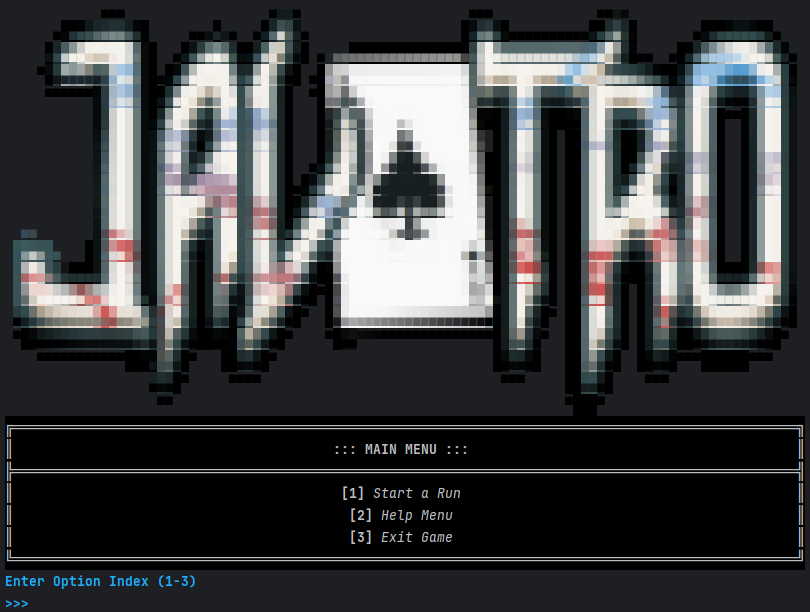

Players will be shown the **Javatro Main Menu** whenever they boot up the game or select `Main Menu`.

#### Menu Options:
- `1. New Game`
- `2. Load Game`
- `3. Help Menu`
- `4. Exit Game`

_Enter `1` if the player wishes to start an entirely new run,
`2` if there is a previous unfinished run and the player continues from where they previously left off, 
`3` to see helpful information about Javatro, or `4` to exit the game._

---

### Selecting a Deck
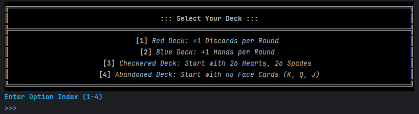
 
After selecting `1. New Game`, players will be prompted to choose from various decks to use at the start of every run.
**Decks** contain playing cards that are key to forming poker hands. 
_Each deck has different effects with unique rules or bonuses._

#### Menu Options:
| Deck                | Effect                                                       |
|---------------------|--------------------------------------------------------------|
| `1. Red Deck`       | Grants the player one additional **discard** per round       |
| `2. Blue Deck`      | Grants the player one additional **hand** per round          |
| `3. Checkered Deck` | Starts with 26 **Hearts** and 26 **Spades**                  |
| `4. Abandoned Deck` | Removes all **face** cards (King, Queen, Jack) from the deck |

_Enter `1`, `2`, `3` or `4` to select your deck._

---

### Choosing a Blind
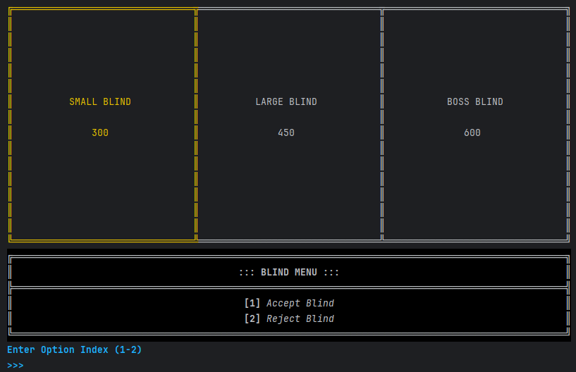

After selecting a deck, players are prompted to select a **Blind**.
Blinds are the main obstacle that the player must overcome in Javatro. 
For each round, the player has to get enough score to beat the Blind, losing the game otherwise. 
_Defeating the Blind will award the player with rewards._

An **Ante** is made up of three Blinds in succession: a Small Blind, a Large Blind, and a random Boss Blind. 
The player can choose to take on a Small or Big Blind, or to skip one or both. 
_Boss Blinds must always be played and cannot be skipped._

The score required by a certain Blind is determined by the Ante level. 
Players start at Ante 1 and go up a level for every Boss Blind defeated, 
and can win the game by beating the last level of a run, at Ante 8.

#### Information Provided:
| Blind Type  | Target Score                     |
|-------------|----------------------------------|
| Small Blind | A **low** score requirement      |
| Large Blind | A **moderate** score requirement |
| Boss Blind  | A **high** score requirement     |

#### Menu Options:
- `1. Accept Blind`
- `2. Reject Blind`

_Enter `1` to accept the current blind and proceed to the game, 
or `2` to reject the current blind and select a different one._

---

### Game Interface
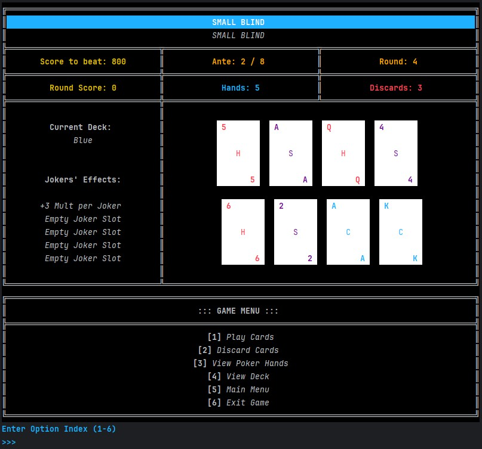

After selecting `1. Accept Blind`, players will be shown the main **Javatro game interface** and dealt cards at the start of each round.

To **defeat a blind**, the player must select cards from their hand to play poker hands and score chips. 
_A given number of discards are available to assist with creating better hands._ 

If the player is unable to reach the blind's chip requirement in the allotted number of hands, 
the run is **lost**, and the player must _restart_ from Ante 1.

Upon reaching the score requirement, the round ends and the player receives rewards.
When Ante 8 is completed, the player **wins** the run, and is allowed to start a new one.

#### Information Provided:
| Blind Information                                          |
|------------------------------------------------------------|
| Blind Name _(Boss Blinds will have unique names)_          |
| Blind Description _(Boss Blinds will have unique effects)_ |

| Score Information                     | Round Information                    | Gameplay Information                   |
|---------------------------------------|--------------------------------------|----------------------------------------|
| Score required to <br/> win the blind | Current Ante count                   | Current Round count                    |
| Total score earned <br/>in this round | Number of Hands<br/> player has left | Number of Discards<br/>player has left |

| Passive Information          | Holding Hand                      |
|------------------------------|-----------------------------------|
| Name of Deck in use          | Cards that are available for play |
| List of active Joker effects | Cards that are available for play |

#### Menu Options:
- `1. Play Cards`
- `2. Discard Cards`
- `3. View Poker Hands`
- `4. View Deck`
- `5. Main Menu`
- `6. Exit Game`

_Enter a number from `1` to `6` to make a gameplay action._

---

### Playing Cards

**_Sorted by Suit_**
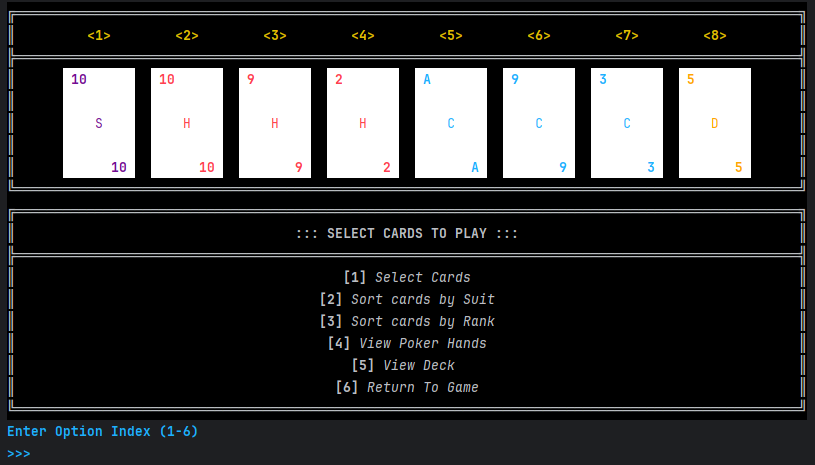

After selecting `1. Play Cards`, the player is directed to the **Play Cards Menu**.  
Players are able to _select_ and _play_ cards to form valid poker hands. 
**Sorting options** are also provided to help arrange cards effectively before making a selection.

#### Menu Options:
- `1. Select Cards` - Choose cards you wish to **play** from your current hand.
- `2. Sort cards by Suit` - Rearranges your cards based on their **suit** _(Spades, Hearts, Clubs, Diamonds)_.
- `3. Sort cards by Rank` - Rearranges your cards based on their **rank** _(Ace, King, ..., 3, 2)._
- `4. View Poker Hands` - Display possible **poker hands** you can form with your current cards.
- `5. View Deck` - Shows all the remaining cards in the **deck**.
- `6. Return To Game` - Go back to the **main game interface** without making any changes.

_Enter a number from `1` to `6` to make a gameplay action._

After selecting `1. Select Cards`, the player will be prompted to input the indices of the cards they wish to play.  
_The player will no longer be able to return to the game interface at this point!_  
_The input indices have to be comma-separated (as shown below)._

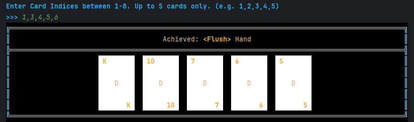

After entering the card indices, the game will show the **cards** the player has chosen to play, 
as well as the **poker hand** that has been formed.

---

### Discarding Cards

**_Sorted by Rank_**
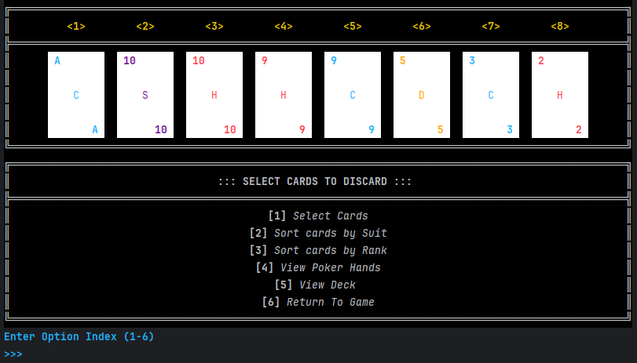  

After selecting `2. Discard Cards`, the player is directed to the **Discard Cards Menu**.  
Player can _strategize_ and make preparations by _discarding_ unwanted cards, 
allowing them to possibly form better poker hands by _redrawing_ new cards.

#### Menu Options:
- `1. Select Cards` - Choose cards you wish to **discard** from your current hand.
- `2. Sort cards by Suit` - Rearranges your cards based on their **suit** _(Spades, Hearts, Clubs, Diamonds)_.
- `3. Sort cards by Rank` - Rearranges your cards based on their **rank** _(Ace, King, ..., 3, 2)._
- `4. View Poker Hands` - Display possible **poker hands** you can form with your current cards.
- `5. View Deck` - Shows all the remaining cards in the **deck**.
- `6. Return To Game` - Go back to the **main game interface** without making any changes.

_Enter a number from `1` to `6` to make a gameplay action._

After selecting `1. Select Cards`, the player will be prompted to input the indices of the cards they wish to discard.
_The player will no longer be able to return to the game interface at this point!_  
_The input indices have to be comma-separated (as shown below)._

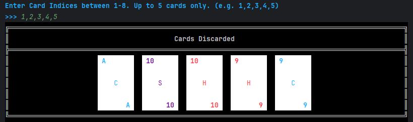

After entering the card indices, the game will show the **cards** the player has chosen to discard.

---

### Viewing the Deck
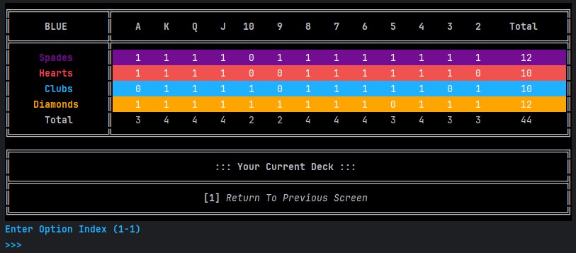

After selecting `View Deck`, players are directed to the **Deck Viewer**, displaying the composition of the current deck. 
It shows the distribution of cards across _suits_ and _ranks_, helping to keep track which cards remain available.

#### Information Provided:
- **Deck Type**: Displayed on the top left.
- **Suits**: Spades, Hearts, Clubs, Diamonds listed _row-wise_.
- **Ranks**: A, K, Q, J, 10, ..., 2 listed _column-wise_.
- **Total Count**: Shows how many **cards** of each rank and suit remain.

_Enter `1` to go back to the previous screen._

---

### Viewing Poker Hands
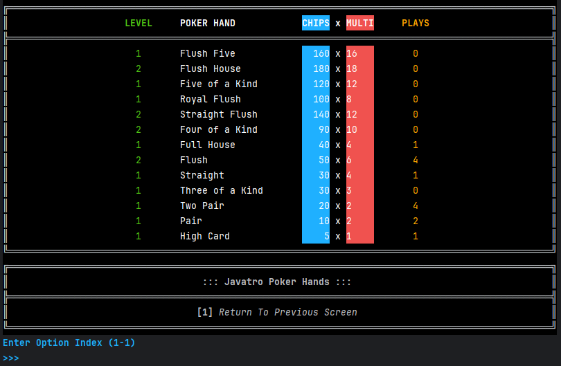

After selecting `View Poker Hands`, players are directed to the **Poker Hand List**, which shows all the possible _poker hands_, 
allowing the player to easily see different statistics to help them plan and optimise.  

**Poker Hands** are sets of between one and five cards that can be played in Javatro to obtain _Chips_ and _Multi_ for scoring.
Each hand also has a **level** that affects its potency.
In a run, all Hands start at Level 1, and are upgraded through **Planet cards**.

Higher tier hands _take precedence_ over lower tier hands regardless of their level or scoring.  
**E.g.** if your played hand is K K K K 2, and all of them are diamonds, the hand will always be a _Four of a Kind_ and never a _Flush_.

#### Information Provided:
- **Level**: The amount of **extra stats** given to a hand _(Incremented through Planet Cards)._
- **Poker Hands**: Listed in _descending order_ of value.
- **Chips**: The _base chip value_ awarded for completing a hand.
- **Multiplier (MULTI)**: The _multiplier_ applied to chips for enhanced rewards.
- **Plays**: The _number of times_ a hand has been successfully played.

_Enter `1` to go back to the previous screen._

#### Poker Hand Descriptions:
| Poker Hand          | Condition                                                                                                                    |
|---------------------|------------------------------------------------------------------------------------------------------------------------------|
| **High Card**       | When no other hand is possible, the one highest card in your hand. Aces are counted high for this hand.                      |
| **Pair**            | Two cards with a matching rank. Suits may differ.                                                                            |
| **Two Pair**        | Two cards with a matching rank, and two cards with any other matching rank. Suits may differ.                                |
| **Three of a Kind** | Three cards with a matching rank. Suits may differ.                                                                          |
| **Straight**        | Five cards in consecutive order which are not all from the same suit. Aces can be counted high or low, but not both at once. |
| **Flush**           | Five cards of any rank, all from a single suit.                                                                              |
| **Full House**      | Three cards with a matching rank, and two cards with any other matching rank, with cards from two or more suits.             |
| **Four of a Kind**  | Four cards with a matching rank. Suits may differ.                                                                           |
| **Straight Flush**  | Five cards in consecutive order, all from a single suit.                                                                     |
| **Royal Flush**     | An ace-high Straight Flush formed by playing A K Q J 10 of the same suit.                                                    |

---

### Winning a Small / Large Blind
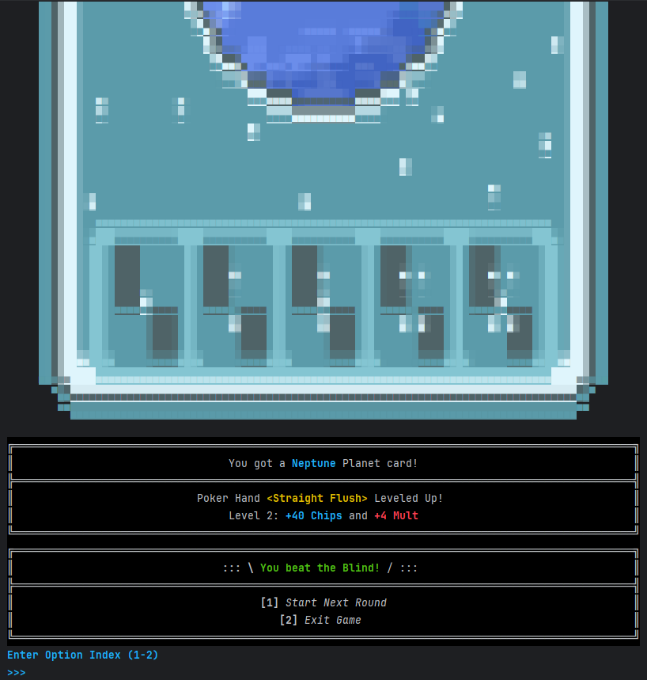

**Small and Large Blinds** have no other effects and can be _skipped_.  
The score required is _1x base chips_ for **Small Blind**, and _1.5x base chips_ for **Large Blind**.  
After completing a Small or Large blind successfully, players will _randomly_ receive one of the 12 available **Planet Cards**. 

**Planet Cards** level up their associated poker hand type by increasing the base value of _chips_ and _multiplier_.

#### Menu Options:
- `1. Start Next Round`
- `2. Exit Game`

_Enter `1` to proceed to the next blind,
or `2` to end the current game session._

#### Planet Card Effects:
| Planet Card | Bonus Stats           | Poker Hand      | Base Score          |
|-------------|-----------------------|-----------------|---------------------|
| Pluto       | +1 Mult and +10 Chips | High Card       | 1 Mult x 5 Chips    |
| Mercury     | +1 Mult and +15 Chips | Pair            | 2 Mult x 10 Chips   |
| Uranus      | +1 Mult and +20 Chips | Two Pair        | 2 Mult x 20 Chips   |
| Venus       | +2 Mult and +20 Chips | Three of a Kind | 3 Mult x 30 Chips   |
| Saturn      | +3 Mult and +30 Chips | Straight        | 4 Mult x 30 Chips   |
| Jupiter     | +2 Mult and +15 Chips | Flush           | 4 Mult x 35 Chips   |
| Earth       | +2 Mult and +25 Chips | Full House      | 4 Mult x 40 Chips   |
| Mars        | +3 Mult and +30 Chips | Four of a Kind  | 7 Mult x 60 Chips   |
| Neptune     | +4 Mult and +40 Chips | Straight Flush  | 8 Mult x 100 Chips  |
| Planet X    | +3 Mult and +35 Chips | Five of a Kind  | 12 Mult x 120 Chips |
| Ceres       | +4 Mult and +40 Chips | Flush House     | 14 Mult x 140 Chips |
| Eris        | +3 Mult and +50 Chips | Flush Five      | 16 Mult x 160 Chips |

---

### Winning a Boss Blind

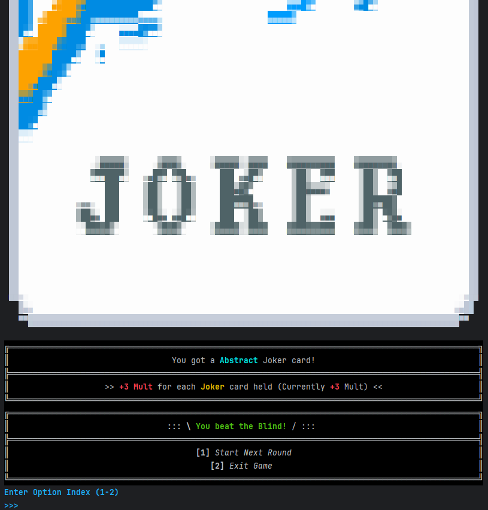

**Boss Blinds** are the last blind of an **Ante**, most of which require a score of _2x base chips_.  
**Boss Blinds** have certain special effects that add difficulty to the round and are randomly selected.
_Boss Blinds cannot be skipped._

After successfully beating a **Boss Blind**, players receive a _random_ **Joker Card**.

**Jokers** are special cards at the core of Javatro's gameplay. They possess _unique effects_ that can synergize, 
and a strong combination of jokers is typically essential for the player to defeat Blinds at higher Antes.

Instead of being included in Decks and played alongside standard cards, 
Jokers are held in the player's _5 dedicated joker slots_, and their effects will automatically be activated during gameplay.

#### Menu Options:
- `1. Start Next Round`
- `2. Exit Game`

_Enter `1` to proceed to the next round,
or `2` to end the current game session._

#### Joker Effects

| Joker      | Effect                                                                        |
|------------|-------------------------------------------------------------------------------|
| Greedy     | Played cards with ♦️ **Diamond** suit give _+3 Mult_ when scored              |
| Lusty      | Played cards with ♥️ **Heart** suit give _+3 Mult_ when scored                |
| Wrathful   | Played cards with ♠️ **Spade** suit give _+3 Mult_ when scored                |
| Gluttonous | Played cards with ♣️ **Club** suit give _+3 Mult_ when scored                 |
| Half       | _+20 Mult_ if played hand contains **3 or fewer** cards                       |
| Scary Face | Played **face** cards give _+30 Chips_ when scored                            |
| Abstract   | _+3 Mult_ for each **Joker** card                                             |
| Odd Todd   | Played cards with **odd rank** give _+31 Chips_ when scored _(A, 9, 7, 5, 3)_ |

---


### Saving / Loading a Game

Neeraj yap


---

## Gameplay Flow

1. **Start Game**  
   Choose to _start_ a new game, or _continue_ a previous saved run.


2. **Select Deck**  
   Choose a deck from the available options.


3. **Select Blind**  
    Choose a blind _(Small, Large, or Boss)_ to determine the target score for the round.


4. **Play Hands**  
    - Choose to `Play Cards` or `Discard Cards` based on your dealt cards.
    - `View Poker Hands` or `View Deck` to strategize and evaluate your current hand.
    - Played cards are assessed, and points are awarded based on the hand formed.


5. **Score & Progress**  
    Accumulate points to meet or exceed the blind level to progress.


6. **Game End**  
   - **Win** by beating _Ante 8 Boss Blind_.
   - **Lose** by failing to meet the required score after using up all your hands.
   - You may _exit_ the game at any point within the game.
   - If you exit the game while a run is currently ongoing, your progress will be _saved_.

---

## Tips for New Players
- **Understand Deck Mechanics**: Each deck provides unique advantages. Choose one that suits your play style.
- **Plan Your Moves**: Don’t rush through rounds. Think carefully about which cards to play or discard.
- **Monitor Your Score**:The blind level you choose influences your gameplay.
- **Utilize Special Cards**: Use Joker and Planet Cards wisely for extra benefits.

---

## FAQs

**Q: How do I view remaining hands/discards?**  
_A: The game screen shows `Hands: X` and `Discards: Y` in the status bar._

**Q: What happens if I run out of hands?**  
_A: The game ends if you fail to meet the target score before exhausting your hands._

**Q: Can I change decks mid-game?**  
_A: No, deck selection is permanent for each run. Start a new game to try different decks._

**Q: What if I enter an invalid command?**  
_A: Javatro displays an error message to help you correct your input._

### How do I navigate through Javatro?

_Navigation throughout the application is done via **numbered options**. 
Selecting an option is done by entering the corresponding number._

```
1. New Game
2. Load Game
3. Exit
```

_For example, in the Main Menu, enter `1` and press `Enter` to start a new game._

---

## Known Issues

### Terminal Window Behavior

**Description:**  
**Javatro**’s UI relies on consistent terminal dimensions to render ANSI graphics and other elements correctly. Two specific scenarios can cause display issues:

1. **Resizing the Terminal Window During Execution:**  
   _Changing_ the terminal window size while the program is running can disrupt the UI layout and cause misalignment or incorrect rendering of output.

2. **Using a Small Terminal Window:**  
   If the terminal window is _not wide enough_, lines may wrap around, distorting the intended structure of ASCII elements and making the output hard to read.

**Recommended Solution:**  
To ensure proper UI rendering, players are advised to:
- Use a **fullscreen terminal window** before starting the program.
- **Avoid resizing** the terminal during program execution.
- Ensure the terminal is **wide enough** to accommodate full-line prints without wrapping.

Following these guidelines will help maintain the intended appearance and functionality of the **Javatro**’s UI.

---

## Glossary

**Ante**  
A stage of a run. Each run is divided into multiple antes (usually eight), 
with each ante consisting of several rounds (blinds) that you must clear to progress.

**Blind**  
A round within an ante where you must score enough points (chips) to beat the challenge. There are three types:
- **Small Blind**: The first round; you can optionally skip it.
- **Big Blind**: The second round; similar to the Small Blind.
- **Boss Blind**: The final round of an ante with a unique, often restrictive challenge. This round cannot be skipped.

**Chips**  
Points earned from playing a hand. 
Each hand’s chip value is calculated from the cards played and later multiplied by a multiplier.

**Multiplier**  
A factor that increases your hand’s chip score. 
Multipliers can be raised through various effects, most notably by equipping Joker cards and obtaining Planet Cards.

**Joker**  
Special cards that reside in your “Joker slots” (up to five by default) and grant passive effects. 
These effects may add chips, boost multipliers, or modify how hands are scored. 

**Playing Cards**  
The standard cards (initially a 52-card deck) that form the basis of every hand.

**Planet Cards**  
Upgrades specific poker hand types by increasing their base chip value and multiplier.

**Discard**  
A limited resource per round that lets you exchange unwanted cards from your hand. 
Managing discards is crucial for optimizing your hand.

**Hand Size**  
The number of cards drawn at the start of each round. It determines your options for forming poker hands.

**Hands**  
The number of times you can play cards during a round (similar to “lives”). 
If you run out of hands before meeting the blind’s score, the run ends.

**Run**  
A complete play session. A run ends when you fail an ante or successfully clear the final Boss Blind.

---

## Acknowledgements

- Javatro game concept is inspired by **Balatro**, a roguelike deck builder game developed by _LocalThunk_ and published by _Playstack_.

---

_**Note**: Screenshots show representative UI elements and may differ slightly in actual gameplay. 
All values reflect current game version v2.1._