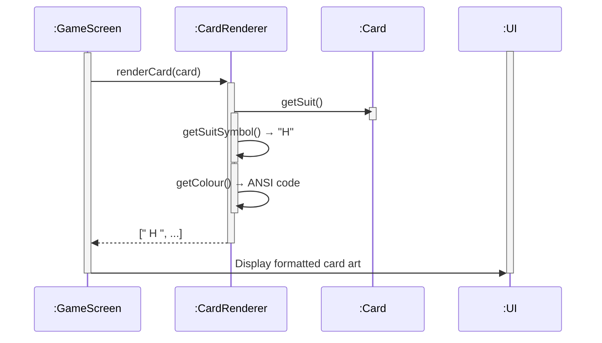

```mermaid  
sequenceDiagram  
    participant #58;GameScreen  
    participant #58;CardRenderer  
    participant #58;Card  
    activate #58;UI
    activate #58;GameScreen
    #58;GameScreen->>+#58;CardRenderer: renderCard(card)
    #58;CardRenderer->>#58;Card: getSuit()
    activate #58;Card
    deactivate #58;Card
    activate #58;CardRenderer
    #58;CardRenderer->>#58;CardRenderer: getSuitSymbol() → "H"
    deactivate #58;CardRenderer
    activate #58;CardRenderer
    #58;CardRenderer->>#58;CardRenderer: getColour() → ANSI code
    deactivate #58;CardRenderer
    #58;CardRenderer-->>-#58;GameScreen: [" H ", ...]
    #58;GameScreen->>#58;UI: Display formatted card art  
    deactivate #58;GameScreen
    deactivate #58;UI
```