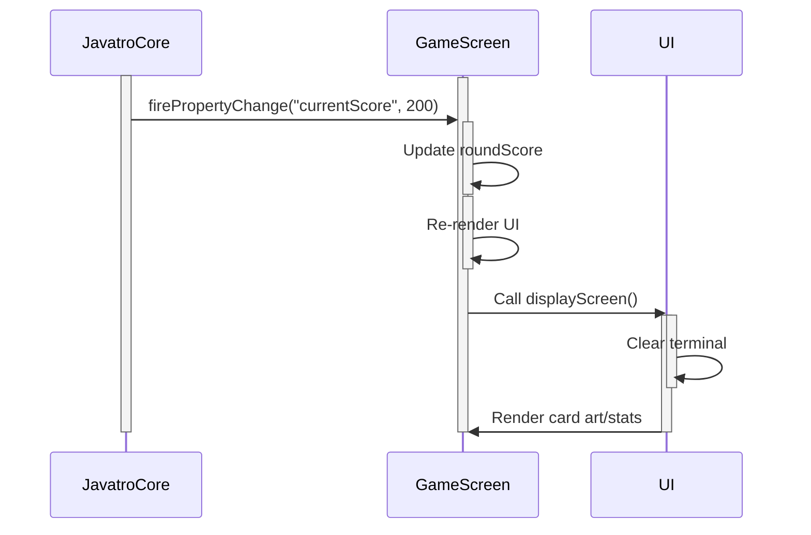

```mermaid  
sequenceDiagram  
    participant JavatroCore  
    participant GameScreen
    participant UI
    activate JavatroCore
    activate GameScreen
    JavatroCore->>GameScreen: firePropertyChange("currentScore", 200)
    activate GameScreen
    GameScreen->>GameScreen: Update roundScore  
    deactivate GameScreen
    activate GameScreen
    GameScreen->>GameScreen: Re-render UI  
    deactivate GameScreen
    GameScreen->>UI: Call displayScreen()  
    activate UI
    activate UI
    UI->>UI: Clear terminal  
    deactivate UI
    UI->>GameScreen: Render card art/stats
    deactivate UI
    deactivate JavatroCore
    deactivate GameScreen

```  