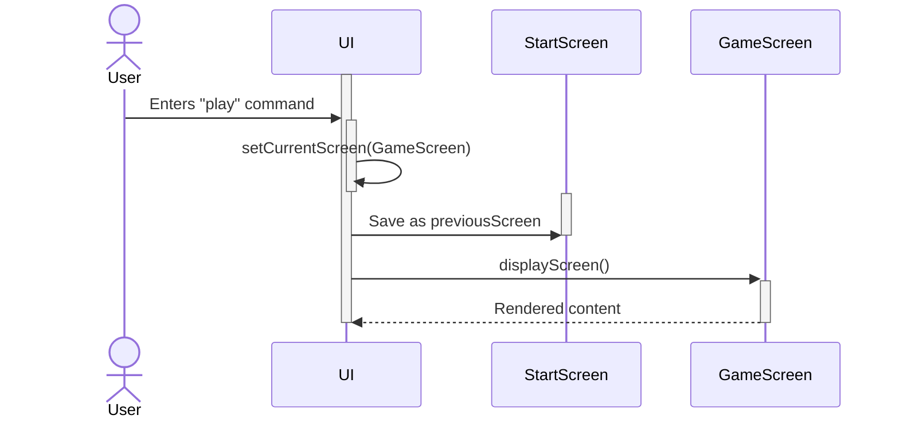

```mermaid  
sequenceDiagram  
    actor User  
    participant UI  
    participant StartScreen  
    participant GameScreen  
    activate UI
    User->>UI: Enters "play" command  
    activate UI
    UI->>UI: setCurrentScreen(GameScreen)  
    deactivate UI
    activate StartScreen
    UI->>StartScreen: Save as previousScreen  
    deactivate StartScreen
    UI->>+GameScreen: displayScreen()  
    GameScreen-->>-UI: Rendered content  
    deactivate UI
```  