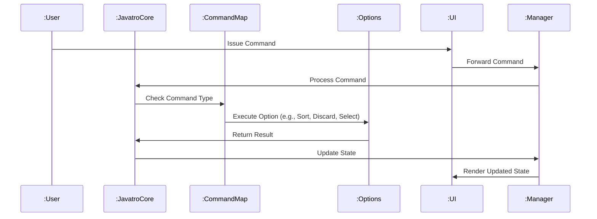

```mermaid
sequenceDiagram
    participant #58;User
    participant #58;JavatroCore
    participant #58;CommandMap
    participant #58;Options
    participant #58;UI
    participant #58;Manager

    #58;User ->> #58;UI: Issue Command
    #58;UI ->> #58;Manager: Forward Command
    #58;Manager ->> #58;JavatroCore: Process Command
    #58;JavatroCore ->> #58;CommandMap: Check Command Type
    #58;CommandMap ->> #58;Options: Execute Option (e.g., Sort, Discard, Select)
    #58;Options ->> #58;JavatroCore: Return Result
    #58;JavatroCore ->> #58;Manager: Update State
    #58;Manager ->> #58;UI: Render Updated State
```