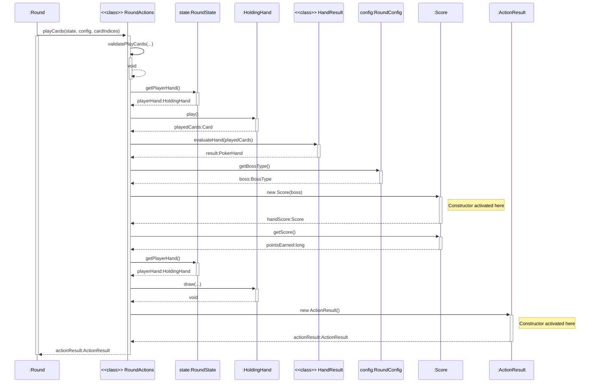
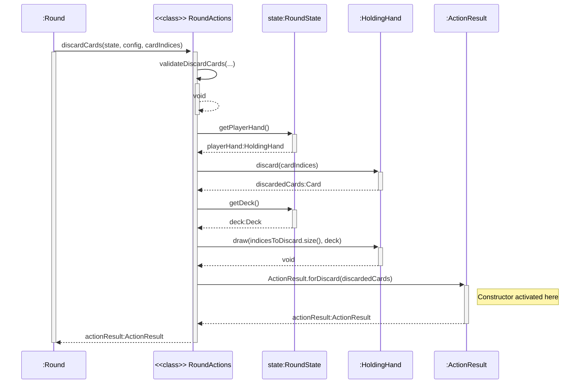

```mermaid
sequenceDiagram
    participant A as :Round
    participant B as <<class>> RoundActions
    participant C as state:RoundState
    participant G as :HoldingHand
    participant E as <<class>> HandResult
    participant D as config:RoundConfig
    participant F as :Score
    participant H as  :ActionResult

    A->>+B: playCards(state, config, cardIndices)
    activate A
    activate B
    B->>B: validatePlayCards(...)
    activate B
    B-->>B: void
    deactivate B
    B->>+C: getPlayerHand()
    C-->>-B: playerHand:HoldingHand
    B->>+G: play()
    G-->>-B: playedCards:Card
    B->>+E: evaluateHand(playedCards)
    E-->>-B: result:PokerHand
    B->>+D: getBossType()
    D-->>-B: boss:BossType
    B->>+F: new Score(boss)
    note right of F: Constructor activated here
    F-->>-B: handScore:Score
    B->>+F: getScore()
    F-->>-B: pointsEarned:long
    B->>+C: getPlayerHand()
    C-->>-B: playerHand:HoldingHand
    B->>+G: draw(...)
    G-->>-B: void
    B->>+H: new ActionResult()
    note right of H: Constructor activated here
    H-->>-B: actionResult:ActionResult
    B-->>A: actionResult:ActionResult
    deactivate B
    deactivate A
```

```mermaid
sequenceDiagram
    participant A as :Round
    participant B as <<class>> RoundActions
    participant C as state:RoundState
    participant F as :HoldingHand
    participant E as :ActionResult

    A->>+B: discardCards(state, config, cardIndices)
    activate A
    activate B
    B->>B: validateDiscardCards(...)
    activate B
    B-->>B: void
    deactivate B
    B->>+C: getPlayerHand()
    C-->>-B: playerHand:HoldingHand
    B->>+F: discard(cardIndices)
    F-->>-B: discardedCards:Card
    B->>+C: getDeck()
    C-->>-B: deck:Deck
    B->>+F: draw(indicesToDiscard.size(), deck)
    F-->>-B: void
    B->>+E: ActionResult.forDiscard(discardedCards)
    note right of E: Constructor activated here
    E-->>-B: actionResult:ActionResult
    B-->>A: actionResult:ActionResult
    deactivate B
    deactivate A
```
