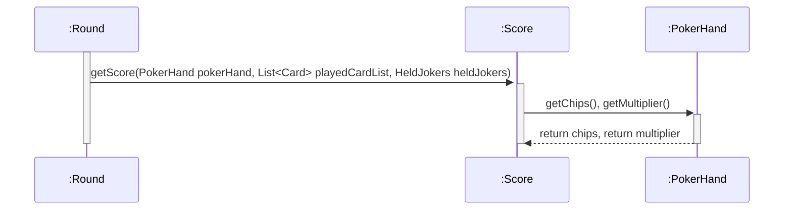

```mermaid
sequenceDiagram
    activate #58;Round
        #58;Round->>+#58;Score: getScore(PokerHand pokerHand, List<Card> playedCardList, HeldJokers heldJokers)
        activate #58;Score
        #58;Score->>+#58;PokerHand: getChips(), getMultiplier()
        #58;PokerHand-->>-#58;Score: return chips, return multiplier
        deactivate #58;Score
    deactivate #58;Round
```