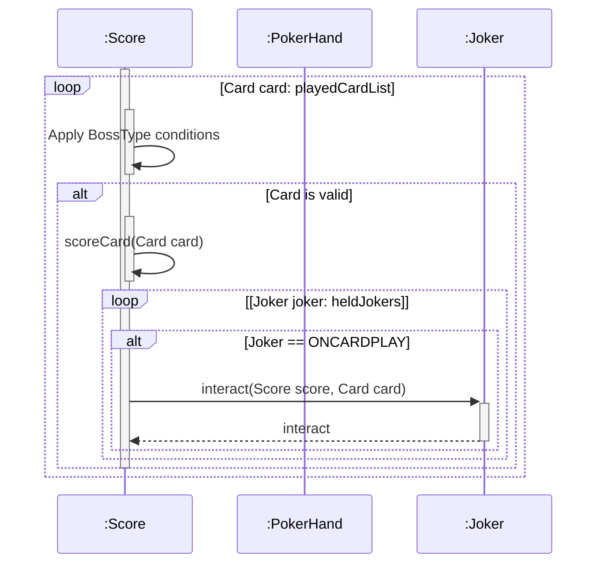

```mermaid
sequenceDiagram
    participant #58;Score
    participant #58;PokerHand
    participant #58;Joker
    activate #58;Score
    loop Card card: playedCardList
        activate #58;Score
        #58;Score->>#58;Score: Apply BossType conditions
        deactivate #58;Score
        alt Card is valid
            activate #58;Score
                #58;Score->>#58;Score: scoreCard(Card card)
            deactivate #58;Score
            loop [Joker joker: heldJokers]
                alt Joker == ONCARDPLAY
                    #58;Score->>+#58;Joker: interact(Score score, Card card)
                    #58;Joker-->>-#58;Score: interact
                end
            end
        end
        deactivate #58;Score
    end
```