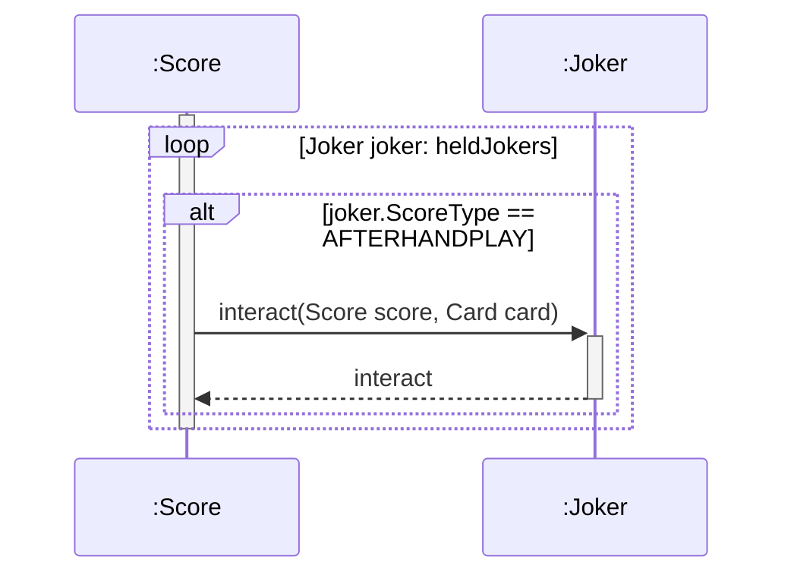

```mermaid
sequenceDiagram
    participant #58;Score

    activate #58;Score
    loop Joker joker: heldJokers
        alt joker.ScoreType == AFTERHANDPLAY
            #58;Score->>+#58;Joker: interact(Score score, Card card)
            #58;Joker-->>-#58;Score: interact
        end
    end
    deactivate #58;Score
```
