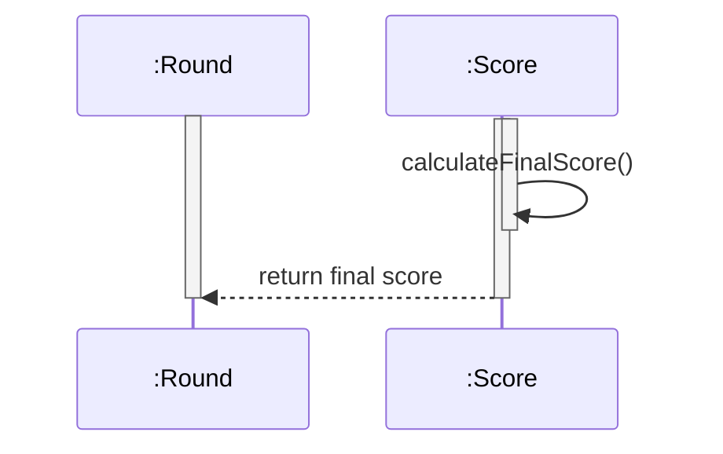

```mermaid
sequenceDiagram
participant #58;Round
participant #58;Score

activate #58;Round
    activate #58;Score
        activate #58;Score
            #58;Score->>#58;Score: calculateFinalScore()
        deactivate #58;Score
        #58;Score-->>#58;Round: return final score
    deactivate #58;Score
    deactivate #58;Round

```
