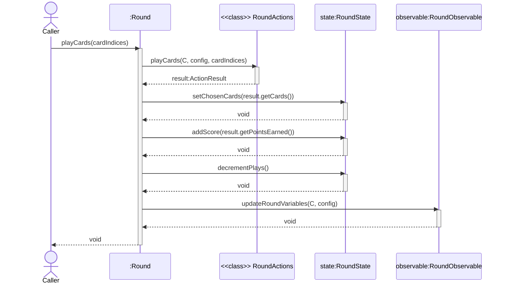
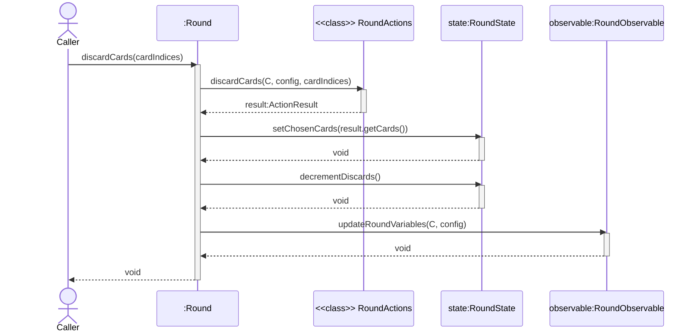
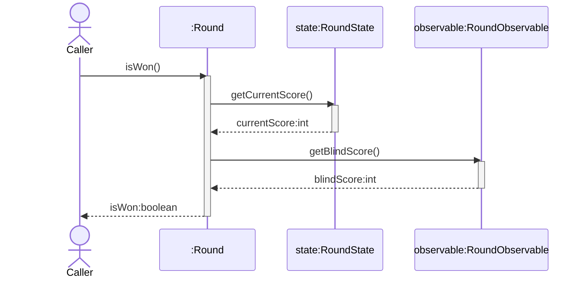
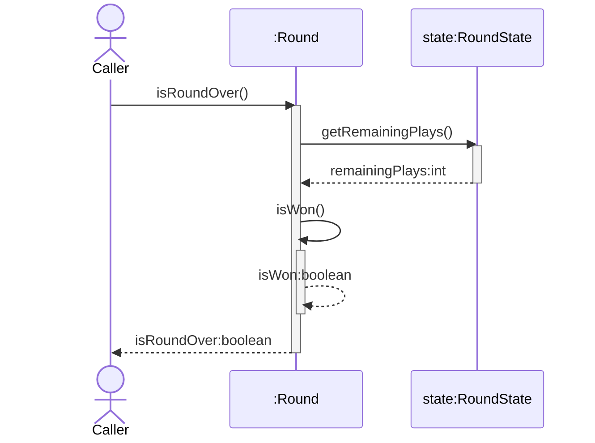

# Playing Cards Flow

```mermaid
sequenceDiagram
    actor Caller
    participant A as :Round
    participant B as <<class>> RoundActions
    participant C as state:RoundState
    participant D as observable:RoundObservable

    Caller->>A: playCards(cardIndices)
    activate A
    A->>B: playCards(C, config, cardIndices)
    activate B
    B-->>A: result:ActionResult
    deactivate B
    A->>C: setChosenCards(result.getCards())
    activate C
    C-->>A: void
    deactivate C
    A->>C: addScore(result.getPointsEarned())
    activate C
    C-->>A: void
    deactivate C
    A->>C: decrementPlays()
    activate C
    C-->>A: void
    deactivate C
    A->>D: updateRoundVariables(C, config)
    activate D
    D-->>A: void
    deactivate D
    A-->>Caller: void
    deactivate A
```

# Discarding Cards Flow

```mermaid
sequenceDiagram
    actor Caller
    participant A as :Round
    participant B as <<class>> RoundActions
    participant C as state:RoundState
    participant D as observable:RoundObservable

    Caller->>A: discardCards(cardIndices)
    activate A
    A->>B: discardCards(C, config, cardIndices)
    activate B
    B-->>A: result:ActionResult
    deactivate B
    A->>C: setChosenCards(result.getCards())
    activate C
    C-->>A: void
    deactivate C
    A->>C: decrementDiscards()
    activate C
    C-->>A: void
    deactivate C
    A->>D: updateRoundVariables(C, config)
    activate D
    D-->>A: void
    deactivate D
    A-->>Caller: void
    deactivate A
```

# Checking if the Round is Won

```mermaid
sequenceDiagram
    actor Caller
    participant A as :Round
    participant C as state:RoundState
    participant D as observable:RoundObservable

    Caller->>A: isWon()
    activate A
    A->>C: getCurrentScore()
    activate C
    C-->>A: currentScore:int
    deactivate C
    A->>D: getBlindScore()
    activate D
    D-->>A: blindScore:int
    deactivate D
    A-->>Caller: isWon:boolean
    deactivate A
```

# Checking if the Round is Over

```mermaid
sequenceDiagram
    actor Caller
    participant A as :Round
    participant C as state:RoundState

    Caller->>A: isRoundOver()
    activate A
    A->>C: getRemainingPlays()
    activate C
    C-->>A: remainingPlays:int
    deactivate C
    A->>A: isWon()
    activate A
    A-->>A: isWon:boolean
    deactivate A
    A-->>Caller: isRoundOver:boolean
    deactivate A
```