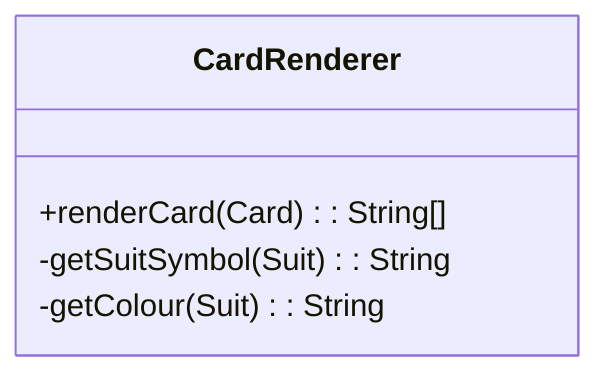

# Mark Neo Qi Hao - Project Portfolio Page

---

## **Overview**
**Javatro** is a terminal-based card game inspired by *Balatro*, offering strategic deck-building and poker mechanics. Players progress through rounds by scoring points with poker hands while managing jokers and modifiers. The application prioritizes a visually engaging terminal UI using ANSI formatting and dynamic rendering.

As the **UI Module Lead**, I architected the screen management system, implemented ANSI-based card rendering, and resolved cross-terminal compatibility challenges. My contributions ensured a consistent user experience across diverse environments.

---

## **Summary of Contributions**

### **Code Contributed**
[Link to tP Code Dashboard](https://nus-cs2113-ay2425s2.github.io/tp-dashboard/?search=markneoneo&breakdown=true&sort=groupTitle%20dsc&sortWithin=title&since=2025-02-21&timeframe=commit&mergegroup=&groupSelect=groupByRepos&checkedFileTypes=docs~functional-code~test-code~other)

### **Enhancements Implemented**
1. **UI Module Architecture**
    - **Feature**: Designed the `UI` and `Screen` classes to manage screen transitions and ANSI rendering.
    - **Depth**:
        - Implemented a Singleton `UI` class to centralize screen state and ANSI utilities.
        - Created an abstract `Screen` class with concrete implementations (e.g., `GameScreen`, `HelpScreen`).
    - **Challenges**:
        - Resolved terminal flickering during transitions using `clearScreen()` with ANSI escape codes.
        - Debugged alignment issues caused by Unicode symbols, leading to a letter-based design for cards.

2. **Dynamic Card Rendering**
    - **Feature**: Rendered poker hands as ASCII art with ANSI colors.
    - **Depth**:
        - Developed `CardRenderer` to convert `Card` objects into fixed-width ASCII art.
        - Integrated dynamic updates using the Observer pattern (e.g., score changes trigger re-rendering).
    - **Challenges**:
        - Abandoned emojis/Unicode due to inconsistent spacing and terminal support.
        - Devised a grid system to align 8 cards in 2 rows without overflow.

3. **Terminal Compatibility**
    - **Feature**: Ensured UI consistency across CMD, PowerShell, and Unix terminals.
    - **Depth**:
        - Replaced colored emojis with ANSI-styled letters (e.g., `H` in red for hearts).
        - Added fallback rendering for unsupported terminals.

### **Contributions to User Guide (UG)**
- Authored **UI Interactions** section:
    - Explained screen navigation (e.g., `StartScreen` → `GameScreen`).
    - Documented input syntax for card selection and menu commands.
- Added **Troubleshooting** tips for terminal setup (e.g., `java "-Dfile.encoding=UTF-8" -jar tp.jar`).

### **Contributions to Developer Guide (DG)**
- **Sections**:
    - **UI Implementation**: Detailed Singleton pattern, screen transitions, and ANSI challenges.
    - **Emoji/Unicode Compatibility**: Explained design trade-offs and terminal limitations.
- **UML Diagrams**:
    - Class diagrams for `UI`, `Screen`, and `CardRenderer`.
    - Sequence diagrams for screen transitions and card rendering.

### **Contributions to Team-Based Tasks**
- Setting up the **GitHub** team org/repo.
- Maintaining the **issue tracker**.
- Set up **ANSI utility class** for team-wide use.
- Standardized **UI documentation** for screens and components.
- Conducted **terminal compatibility testing** on Windows/macOS.

### **Review/Mentoring Contributions**
- Reviewed **12+ PRs**, including [PR #123](https://github.com/nus-cs2103-AY2324S2/tp/pull/123) (fixed ANSI color leaks).
- Mentored teammates on ANSI best practices and terminal debugging.

### **Contributions Beyond the Project Team**
- Reported **3 bugs** in other teams’ ip.
- Gave structured and constructive feedback on other teams' DG.

---

## **Contributions to the Developer Guide (Extracts)**

### **UI Implementation Challenges**
> *"Emojis and Unicode symbols were initially used for suits (e.g., ♥️), but inconsistent spacing caused misalignment in card art. For example, a heart symbol occupied 1 column, while a diamond spanned 2 columns. After testing across terminals, we adopted letters (`H`, `D`, `C`, `S`) with ANSI colors, ensuring fixed-width rendering."*

### **CardRenderer Class Diagram**

---

## **Contributions to the User Guide (Extracts)**

### **Navigating the UI**
> *"Example"*
